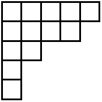
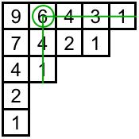
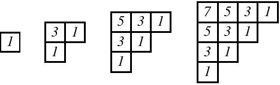
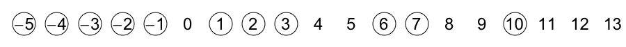
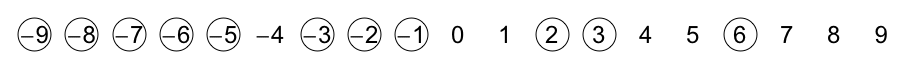
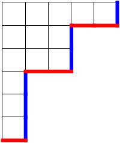
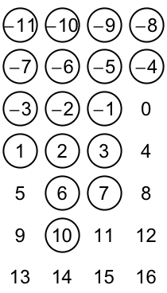
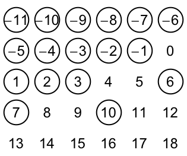

In this post I hope to share insights into an article that [Brant Jones](http://educ.jmu.edu/~jones3bc/), [+Drew Armstrong](http://plus.google.com/103061162497127117651), and I wrote up this year and submitted for publication at the beginning of August named "Results and conjectures on simultaneous core partitions"—it is available online at [http://arxiv.org/abs/1308.0572](http://arxiv.org/abs/1308.0572).  As [I mentioned earlier](../2013-08-09-why-blog-about-mathematics/index.qmd), I aim to write informally about these topics but what I write may still be hard to follow.  Be assured that your questions are welcomed in the comments.  And DO let me know what you think of this writeup!  What is the best part?  What can be improved?

I would suggest trying to read at least the introduction of the article because I think Drew did a really great job motivating the beauty of the subject and setting the stage for the main results of the paper. While Brant and I did help implement a few modifications to Drew's exposition, the introduction is for the most part Drew's handiwork.

Let me now try to go into more details for the uninitiated.  In this first post, I'll introduce the objects that are the focus of the article—core partitions and related objects called abacus diagrams.

### Partitions

A **partition** (of an integer $n$) is a way to break down $n$ into smaller integral parts.  For example, $5+4+2+1+1=13$, so we would say that $(5,4,2,1,1)$ is a partition of $13$.    The order of the parts doesn't matter, which means that $3+1+1$ and $1+1+3$ would be considered the same partition of $5$.  (When the order of the parts *does matter*, we would be talking about **compositions** instead of partitions.)  For this reason, we can and we will always write the numbers in decreasing (really non-increasing) order.

We often use greek letters to represent partitions (especially lambda $\lambda$, mu $\mu$, and nu $\nu$).  So if we want to talk about an arbitrary partition, we might say "Let $\lambda=(\lambda_1,\lambda_2,\dots,\lambda_k)$".  Inherent to this notation are that $\lambda$ is broken down into exactly $k$ parts, that $\lambda_1$ is the largest part, and that $\lambda_k$ is the smallest part (and not equal to zero).

My favorite thing about partitions has to do with the generating function for the number $p_n$ of partitions of $n$:

$$\sum_{n=0}^\infty p_nx^n=\prod_{i=1}^\infty \frac{1}{1-x^i}.$$

Understanding this is a bit involved so I'll delay that for a future post.  However, even if the answer is complicated, the question is very natural since if you are stranded on a desert island (or otherwise have nothing else to do) and in front of you you have a pile of 10 similar-looking rocks, you might start playing around and divide the rocks into piles.  (A partition of 10!)  You may even find all **[42](http://en.wikipedia.org/wiki/Answer_to_the_Ultimate_Question_of_Life,_the_Universe,_and_Everything)** partitions of 10, starting with one pile of ten and ending with ten piles of one rock each.

Since partitions arise naturally when you break down a discrete set of indistinguishable objects, one would expect partitions to appear in multiple areas of mathematics, and they do.  There are entire books devoted to [integer partitions](http://www.cambridge.org/us/academic/subjects/mathematics/number-theory/integer-partitions) and the [mathematics arising from them](http://www.cambridge.org/us/academic/subjects/mathematics/algebra/theory-partitions).  Many famous mathematicians have worked on partitions including the amazing [Srinivasa Ramanujan](http://en.wikipedia.org/wiki/Srinivasa_Ramanujan).

### Pictures

A nice way to represent a partition is by using a Young diagram, where we use up- and left- adjusted boxes with $\lambda_i$ boxes in row $i$.  For example, the Young diagram for $\lambda=(5,4,2,1,1)$ is:

<table align="center" cellpadding="0" cellspacing="0" class="tr-caption-container" style="margin-left: auto; margin-right: auto; text-align: center;"><tbody>
<tr><td style="text-align: center;"></td></tr>
<tr><td class="tr-caption" style="text-align: center;">Young diagram of (5,4,2,1,1)</td></tr>
</tbody></table>

As you can see, there are $5$ boxes in the first row, $4$ boxes in the second row, $2$ boxes in the third row, and $1$ box in each of the fourth and fifth rows.  By representing a partition in this way, we see that the number of boxes in the diagram is the number $n$ that $\lambda$ is partitioning.

A partition $\lambda$ is called **self-conjugate** if its diagram is symmetric about its main diagonal.  The picture above is not self-conjugate because the second row has more boxes than the second column does.

With this visualization, each box now has a physical location, and we can assign a number to each box based on this location.  For each box $B$, we will define its **hook length** to be the number of boxes to the right of $B$ plus the number of boxes below $B$ plus $1$ (for $B$ itself).  By connecting these boxes, this creates a "hook" shape, hence the name hook length.  Check that this definition makes sense by verifying the hook lengths for each box in this figure:

<table align="center" cellpadding="0" cellspacing="0" class="tr-caption-container" style="margin-left: auto; margin-right: auto; text-align: center;"><tbody>
<tr><td style="text-align: center;"></td></tr>
<tr><td class="tr-caption" style="text-align: center;">Young diagram with hook lengths of each box inserted</td></tr>
</tbody></table>

The most amazing thing related to hook lengths is the *hook length formula*, which (among other things) counts the number of ways in which you can fill the boxes of a partition's Young diagram from $1$ to $n$ satisfying that numbers increase as you move right and as you move down.   These fillings are called **[standard Young tableaux](http://www.ams.org/notices/200702/whatis-yong.pdf)**.  The theorem of Frame-Robinson-Thrall states that:

:::: {style="text-align: center;"}

The number of standard Young Tableaux of shape $\lambda=\displaystyle\frac{n!}{\displaystyle\prod_{\text{boxes } B} h(B)}$.

::::

For example, if we wanted to fill the partition above with numbers from $1$ to $13$ so that the numbers increase to the right and increase downward, there would be $\frac{13!}{9\cdot7\cdot6\cdot4^3\cdot3\cdot2^2\cdot1^4}=193050$ ways to do so.  First, I'm amazed that this value is always an integer, no matter what the shape of the diagram is.  And second, I'm even more amazed that it counts standard Young tableaux!

### Core partitions

We now have enough information to define a core partition.  A partition $\lambda$ is an **$a$-core partition** if its Young diagram contains no boxes with hook length $a$.  (I may call them simply **$a$-cores** below.)  You can check that the partition from above is both a $5$-core partition and an $8$-core partition since there are no boxes of hook length $5$ or $8$.

Every partition is either an $a$-core or it is not.  For $a\geq 2$, there are infinitely many $a$-core partitions so it does not make sense to "count" them.  But as a combinatorist that is always just the beginning of the story; there are always many further questions we can ask.

**Question 1.**  Is it possible to characterize which partitions are $a$-core partitions for a given value of $a$?

**

**
**(Barely useful) Answer 1:**  Interestingly, the only partitions that are $2$-core partitions are the staircase partitions $\lambda=(n,n-1,\dots,1)$ for all $n$.

<table align="center" cellpadding="0" cellspacing="0" class="tr-caption-container" style="margin-left: auto; margin-right: auto; text-align: center;"><tbody>
<tr><td style="text-align: center;"></td></tr>
<tr><td class="tr-caption" style="text-align: center;">Staircase partitions</td></tr>
</tbody></table>

**Question 2.**  For which values of $n$ does there exist a partition of $n$ that is an $a$-core?

(Notice that Answer 1 tells us that not every value of $n$ has an $a$-core because only the triangular numbers 1, 3, 6, 10, etc. will have a $2$-core.)

**Answer 2.**   [Ken Ono](http://www.mathcs.emory.edu/~ono) [proved](http://www.mathcs.emory.edu/~ono/publications-cv/pdfs/003.pdf) that when $a$ is at least four, there will always exist a partition of $n$ that is an $a$-core.  So you can sleep well at night knowing that there exists a partition of 1000 that is a 42-core.

Rishi Nath and I asked questions like this about self-conjugate core partitions and published our results in [The number of self-conjugate core partitions](http://arxiv.org/abs/1201.6629), which appeared in the [Journal of Number Theory](http://dx.doi.org/10.1016/j.jnt.2012.08.017).

**Question 3.**  How many $a$-core partitions are also $b$-core partitions?

**Answer 3.**  Notice that we might expect the answer to be infinitely many (there are infinitely many $a$-cores and infinitely many $b$-cores!), but instead we have the following theorem, [proved](http://www.sciencedirect.com/science/article/pii/S0012365X01003430) by Jaclyn Anderson:  When $a$ and $b$ are relatively prime, there are only finitely many partitions that are both $a$-core and $b$-core.  Moreover and more impressively, she proved that the exact number is $\displaystyle\frac{1}{a+b}\binom{a+b}{a}$.

We simplify our terminology by saying that a partition $\lambda$ is a **simultaneous $(a,b)$-core partition** (or simply an $(a,b)$-core) if it is an $a$-core and a $b$-core at the same time.

### Abacus diagrams

My favorite thing about core partitions (and simultaneous core partitions) is the wealth of related combinatorial interpretations.  In other words, there are other discrete objects that act like cores in some ways and by studying these alternate objects we learn more about cores, and vice versa.  I know of over a dozen related combinatorial interpretations and my personal long-term goal is to write up an illustrated dictionary/thesaurus about them.  I am always on the lookout for more, so feel free to contact me about this project!  The remainder of this blog post will be about abacus diagrams.

An **abacus diagram** (or simply an **abacus**, plural abaci) is an infinite sequence of beads and gaps, one for each integer, that starts with only beads and ends with only gaps.  We can represent this visually by placing the integers on a number line and circling the beads and not circling the gaps:

<table align="center" cellpadding="0" cellspacing="0" class="tr-caption-container" style="margin-left: auto; margin-right: auto; text-align: center;"><tbody>
<tr><td style="text-align: center;"></td></tr>
<tr><td class="tr-caption" style="text-align: center;">An abacus diagram</td></tr>
</tbody></table>

In this picture, there are beads for every integer less than or equal to $-5$, for $-2$, $-1$, $2$, $3$, and $6$, while every other integer corresponds to a gap.  The essential part about an abacus is the ***sequence*** of beads and gaps, not the numbers.  In particular, if we shifted all the numbers by four, we would have the same abacus diagram with a different labeling, represented visually here:

<table align="center" cellpadding="0" cellspacing="0" class="tr-caption-container" style="margin-left: auto; margin-right: auto; text-align: center;"><tbody>
<tr><td style="text-align: center;"></td></tr>
<tr><td class="tr-caption" style="text-align: center;">The SAME abacus diagram</td></tr>
</tbody></table>

I claim that every abacus diagram corresponds to a unique partition, and that every partition corresponds to a unique abacus diagram.  To prove this claim, we can construct a bijection—a systematic rule that pairs up one object of type A with one and exactly one object of type B.  (♥♥♥ I looove bijections! ♥♥♥)  This bijection comes from James and Kerber's book [The Representation Theory of the Symmetric Group](http://www.cambridge.org/us/academic/subjects/mathematics/algebra/representation-theory-symmetric-group).  We first show how to find an abacus diagram from a partition.

**Key bijection.**   Given a partition $\lambda$, draw its Young diagram.  Next, follow the South-East boundary of the partition from bottom to top, recording a gap for each horizontal step and recording a bead for each vertical step.  Fill out the rest of the infinite sequence by padding this sequence with infinitely many initial beads and infinitely many terminal gaps.  This gives an abacus diagram.

Finding a partition from an abacus diagram is the simple reverse of this process.  Start with an infinite sequence of beads and gaps, then starting from the first gap until the last bead, record a horizontal step for a gap and a vertical step for a bead.

Check that the partition that matches the abacus diagram from above is $(6,3,3,1,1,1)$, shown here with red horizontal steps (corresponding to gaps) and blue vertical steps (corresponding to beads).

<table align="center" cellpadding="0" cellspacing="0" class="tr-caption-container" style="margin-left: auto; margin-right: auto; text-align: center;"><tbody>
<tr><td style="text-align: center;"></td></tr>
<tr><td class="tr-caption" style="text-align: center;">The partition corresponding to the above abacus diagram</td></tr>
</tbody></table>

The power of abacus diagrams comes when we stack the sequence of beads and gaps into columns.  For example, if we took our abacus from above and arranged the beads and gaps into four columns, we would have the following picture (with the understanding that all smaller numbers are beads and all larger numbers are gaps).

<table align="center" cellpadding="0" cellspacing="0" class="tr-caption-container" style="margin-left: auto; margin-right: auto; text-align: center;"><tbody>
<tr><td style="text-align: center;"></td></tr>
<tr><td class="tr-caption" style="text-align: center;">Our abacus arranged into four columns IS $4$-flush</td></tr>
</tbody></table>

This does not seem like much of a change, except that we notice something special: no gap appears *above* a bead.  We will say that this abacus is **$4$-flush**, because when the beads and gaps are arranged into four columns, all the beads are flush-upward in each column.  If we had instead used six columns, the diagram would *not* be $6$-flush because (for example) there is a bead in position $10$ and a gap in position $4$.

<table align="center" cellpadding="0" cellspacing="0" class="tr-caption-container" style="margin-left: auto; margin-right: auto; text-align: center;"><tbody>
<tr><td style="text-align: center;"></td></tr>
<tr><td class="tr-caption" style="text-align: center;">Our abacus arranged into six columns is NOT $6$-flush</td></tr>
</tbody></table>

We align the abaci into columns because:

**

**
**Amazing Fact: **A partition $\lambda$ is $n$-core if and only if its corresponding abacus is $n$-flush!

The reason for this is that a hook of length $n$ in a Young diagram corresponds exactly to a bead-gap pair where the bead occurs $n$ entries earlier than the gap in the abacus diagram, which is why a gap would occur above a bead in the stacked abacus diagram.  We can infer that the above blue-red rimmed partition is a $4$-core partition and not a $6$-core partition because the corresponding abacus is $4$-flush and not $6$-flush.

**Consequence:  **A simultaneous $(a,b)$-core corresponds to an abacus diagram that is simultaneously $a$-flush and $b$-flush.

While the article I wrote with Brant and Drew has as its subject simultaneous core partitions, it turns out to be much easier to work with these "simultaneous abacus diagrams", and they form the basis for the arguments in the article.  In fact, a working title for the article was once "Applications of abacus diagrams to simultaneous core partitions".

### Stopping for now

In Part 2 (which I hope I continue to have the energy for), I plan to talk about the beautiful geometry of simultaneous core partitions.   Then Part 3 will deal with combinatorial statistics and $q$-analogs of Catalan numbers.  Although a new post is unlikely to appear for at least a month.

Until then,

The Mathematical Zorro

<!--(In fact, a working title for this paper was once "Applications of abacus diagrams to simultaneous core partitions".)

-->
