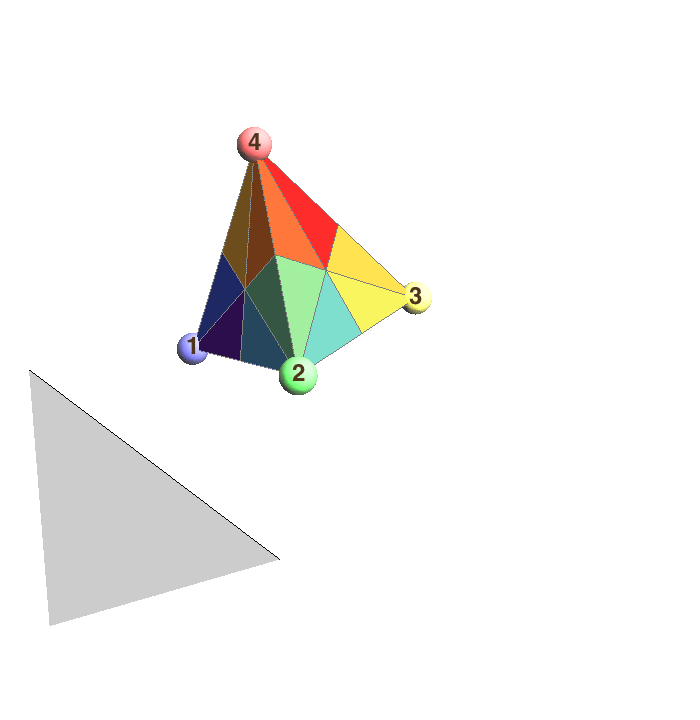

In [a recent Google+ post](https://plus.google.com/+ChristopherHanusa/posts/VWEY7i7P41y),  I shared an animation that sliced a tetrahedron along the six planes of symmetry and casually mentioned that the 24 colored regions corresponded to the permutations of $\{1,2,3,4\}$.

Here is a new animation that highlights the appearance of permutations of $\{1,2,3,4\}$.

We label the four vertices of the tetrahedron by the numbers $1$, $2$, $3$, and $4$.  When we do this, we see that any automorphism of the tetrahedron reorders the labels of the vertices, which is simply a permutation of $\{1,2,3,4\}$.  (I use the technical term "automorphism" to mean any way to *rotate* or *reflect then rotate* the tetrahedron and get back the same shape afterward.)

In the animation above, I highlight three special reflections:

$R_1$:  The transposition of vertices 1 and 2

$R_2$:  The transposition of vertices 2 and 3

$R_3$:  The transposition of vertices 3 and 4

They are special because every permutation of $\{1,2,3,4\}$ can be generated by a sequence of these reflections.  For example, if we apply the reflection $R_1$ first, then $R_2$ second, and then $R_3$ third, this corresponds to starting with $1234$, switching the first two positions to get $2134$, then switching the two middle positions to get $2314$, and finally switching the last two positions to get $2341$.  So we might write that the product $R_1\cdot R_2\cdot R_3$ *equals* the permutation $2341$.

Of course this equality depends on your convention for the order in which you multiply elements, left to right or right to left, and that is a post for another time.
