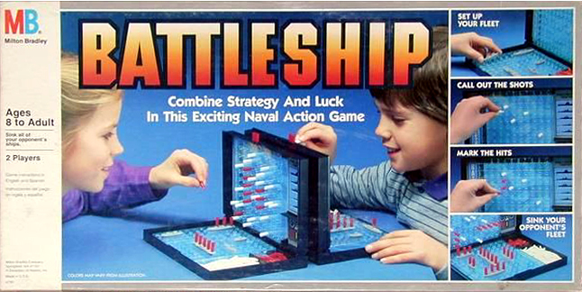
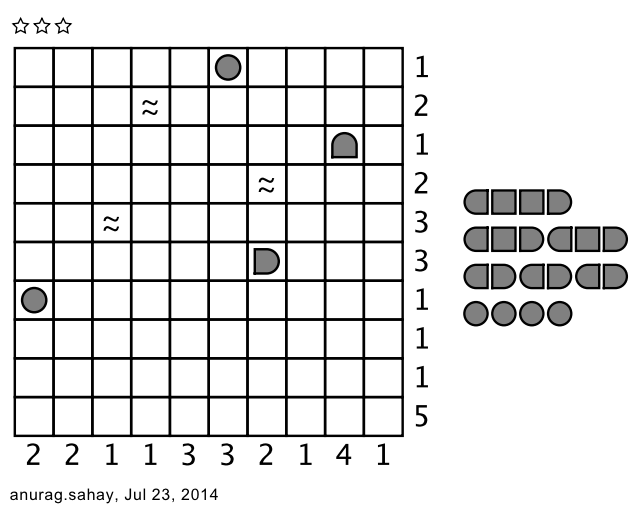

This semester I am teaching [Math 555: Games and Puzzles](https://hanusa.xyz/courses/555/16/) for the first time.  The class does not serve as a prerequisite for any other class and it does not fulfill any degree requirements more than miscellaneous math credits, which means that I have a free hand to teach the content I want to teach.  This class is normally offered during the summer and recently the class has been taught with a focus on game theory.  Instead, I decided to focus on one of my favorite past times, ***pencil puzzles***.  These are small puzzles that can be solved using pure logic.  Many people will have tried to solve the most ubiquitous of pencil puzzles---Sudoku!

(A quick tangent to provide good pencil puzzle links!  Three high-quality websites for downloads and online play of pencil puzzles are [Nikoli](https://www.nikoli.co.jp/en/), [Conceptis Puzzles](http://www.conceptispuzzles.com/), and [Puzzle Picnic](http://puzzlepicnic.com/genres) (user-generated puzzles).  Two excellent puzzle magazines (which also include word puzzles) are [Games World of Puzzles](http://www.gamesmagazine-online.com/) and [Dell Math & Logic Problems](https://www.pennydellpuzzles.com/).)

I wanted to get a bit off the beaten path and away from Sudoku, and not even focus on the two types of pencil puzzles that I suggest to friends (and enemies) as being "after Sudoku": Hashi ([ni](https://www.nikoli.co.jp/en/puzzles/hashiwokakero/), [cp](http://www.conceptispuzzles.com/index.aspx?uri=puzzle/hashi)) and Slitherlink ([ni](https://www.nikoli.co.jp/en/puzzles/slitherlink/), [cp](http://www.conceptispuzzles.com/index.aspx?uri=puzzle/slitherlink), [pp](http://puzzlepicnic.com/genre?fences)).  In fact, a couple students had already seen these puzzles.  Instead, I decided to first start with Battleships ([cp](http://www.conceptispuzzles.com/index.aspx?uri=puzzle/battleships), [pp](http://puzzlepicnic.com/genre?battleships)).  This is a solitaire version of the [two-player game](https://boardgamegeek.com/boardgame/2425/battleship) you may have played pictured here:

In both games, you are searching for a fleet of ships that are placed in a grid.  In the two-player game, your opponent places ships in a way that they think will be difficult to find, and you guess the positions.  In the pencil puzzle solitaire version, a fleet of ships is hidden and your only clues are the number of grid cells in each column and in each row that are covered by some ship.  With these numbers, there is one unique solution that can be found purely by logic.  Here is a moderate-to-difficult puzzle created by user [anurag.sahay on Puzzle Picnic](http://puzzlepicnic.com/puzzle?2914):

There is the additional rule that no two ships can touch, even diagonally, which reduces the amount of possible placements.  Try out a first few sample puzzles [at Conceptis Puzzles](http://www.conceptispuzzles.com/index.aspx?uri=puzzle/battleships).

This was the first class I have taught in which I have no idea how the semester is going to play out---I am taking the class day by day with the ultimate goal of compiling a collection of student-created puzzles of many types.  In my next post, I will discuss the first days of the semester and how things have gone.

A quick thank you to [Sarah Mason](https://sites.google.com/wfu.edu/sarahmason), who acted as a sounding board for the course structure before the beginning of the semester, to my students for being enthusiastic participants on this adventure, and to my department for their support in allowing me to teach such an amazing class!

*This blog post is part of the Queens College Teaching Circle blog; it is cross-posted on my personal teaching blog, [Math Razzle](../../index.qmd).*
