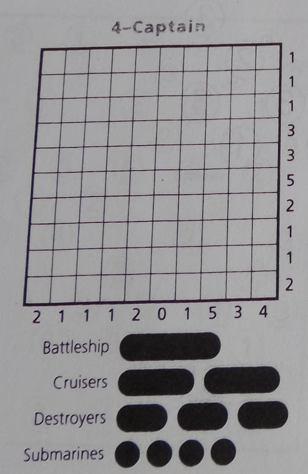
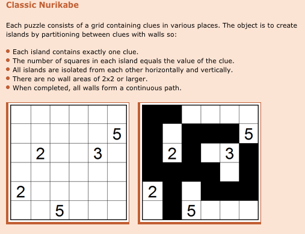

**Abstract:** In the first six days of my pencil puzzles class, my students have had to think deeply about solving and creating Battleships puzzles.  This post discusses the day-to-day class mechanics and assignments.

Now I'll talk about the first few days of [my pencil puzzles class](http://qc.edu/~chanusa/courses/555/16/).  ([Previous post setting the stage](../2016-02-22-teaching-pencil-puzzles/index.qmd).)  I started the first day of class by qualifying that this class was new to me and would be an adventure for them and for me.  I explained that there wouldn't be any lectures, there wouldn't be any exams, and that it was unclear exactly what the assessments would be---the initial ideas I included on the syllabus were:

- One-page-long essays about the history of certain puzzles and related solving techniques.

- Curation of content for a wiki about puzzles, puzzle solving, and puzzle creation.

- New puzzles with accompanying discussion of the methods used to create them.

- The uploading of puzzles to web repositories.

- The creation of a puzzle trove.

I conveyed that I wanted the class to be a student-driven discussion about the solving and creation of pencil puzzles.  The rest of the first day was filled with a worksheet with four types of pencil puzzles and the students worked on two of the types.  The first homework assignment was to work on 12 Battleships puzzles I had copied from puzzle magazines I had laying around and for the students to address the following prompts:

- What strategies are you using? (Give them names. Give a simplified example of what the strategy says. Only including the relevant parts of the puzzle board.)

- What makes one puzzle harder than another? Try to find a way to explain it in words.

- How does knowing that there is one unique solution help you?

- Highlight areas where you get "stuck". If you are able to get past being stuck, how were you able to do so? Take a picture with phone/camera. What happened at that moment in time? Why are you able to make a mark? What logical reasoning are you using? What was the "AHA" moment?

On the second day of class, students discussed their strategies and I served as scribe.  In our brainstorming session before the start of the semester, Sarah Mason had drawn on her own classroom experience to suggest that we give the solving strategies names so that they would be easier to discuss, similar to how names are given to strategies on [Sudoku solving websites](https://www.kristanix.com/sudokuepic/sudoku-solving-techniques.php).  I thought that this was a great idea, since it would solidify a strategy with a clever name and as mathematicians, it is always good to define commonly occurring concepts.  However, the naming of techniques didn't take hold.  Either there was a lack of creativity for punny names, or just no appetite for giving the techniques names, so I abandoned this idea after the second day of class.

I found it especially worthwhile when a student projected onto the screen a before-and-after pair of pictures.  He showed a situation where he was stuck, and then detailed the logical reasoning that it took to get to write the next mark on the paper.  This sort of play-by-play analysis is crucial in conveying one's logic and strategies to the class.  The detailed discussion of strategies we had in class was universally considered to be helpful, and led to the next homework assignment of completing more complicated battleships puzzles before the next class.

On the third day we spent the whole day working through the following battleships puzzle from start to end because ***every*** single student was stuck:

:::: {style="text-align: center;"}

::::

This led to an in-depth discussion about the concept of a [decision tree](https://en.wikipedia.org/wiki/Decision_tree), and that battleships puzzles that are hard often have a wide and deep decision tree.  In other words, in order to figure out the next mark to place, there are many possibilities for the placement of the next ship (Either here or here or here or ...) and for each of those choices, the sequence of logical steps leading to a contradiction is complicated.  Our discussion about this puzzle was especially interesting because of the appearance of the 21112 clues on the bottom left.  We discussed how the uniqueness of a solution implies that there must be some symmetry in the placement of ships, restricting the possible next moves.  The homework for the next day was as follows:

- Create two or more Battleships puzzles with some intrigue, at least one of which is a Junior Battleships puzzle. As you do so, answer the following questions.

- What is hard about creating a puzzle?

- How do you know your puzzle has a unique solution?

- How does creating puzzles influence how you solve them?

So on the fourth day, the students brought in their hand-crafted battleships puzzles, we arranged the chairs in a circle and had a deep discussion about the difficulties involved in their creation.  As I moderated this lively discussion about puzzle creation, I transcribed a number of themes that kept reappearing, from which the homework assignment for the following day emerged organically:

- Create one or more Battleships puzzles that push the boundaries imposed by the normal structure of a Battleships puzzle.

- Write up a page of discussion about the making of your puzzle.
  - What conscious decisions went into its construction? What boundaries did you push? Which decisions make the puzzle easier or harder to create? Easier or harder to solve?
  - How does puzzle uniqueness play a role in its construction?
  - How does the tension between "uniqueness of solution" and "puzzle difficulty" come into play?
  - What direction were you using in its construction? Forward? Backward?

The last half-hour of this fourth day was spent working on peer-created puzzles that had collected copied in our office.  One issue that arose is that some of the puzzles did not have a unique solution.  This served as a warning that everyone needs to be very careful when creating the puzzles.

The fifth day was a day of presentations.  Each student came to the front of the class and projected their puzzle on the screen, and talked for a few minutes about their puzzle and the boundaries they pushed when creating it.  Some students changed the shape of the board.  Some students changed the instructions.  Some students changed the number and types of ships.  One student even created a battleships puzzle on a torus!  To me the most amazing part of the day was that the nine students who presented had each pushed the boundaries in distinct ways!  We ended the day by introducing our next type of pencil puzzle: Nurikabe ([ni](http://www.nikoli.com/en/puzzles/nurikabe/), [cp](http://www.conceptispuzzles.com/index.aspx?uri=puzzle/nurikabe), [pp](http://puzzlepicnic.com/genre?islands)), which the students would have to practice solving for the next class.  The following screenshot about Nurikabe is from [Conceptis Puzzles](http://www.conceptispuzzles.com/index.aspx?uri=puzzle/nurikabe/rules):

:::: {style="text-align: center;"}

::::

Monday 2.22 was the sixth day of class, and students came in to discuss their trials and tribulations in solving Nurikabe puzzles.  We once again arranged the chairs in a circle, and I moderated a discussion about the difference between Battleships and Nurikabe.  What was the most fascinating to me was the palpable interest in and anxiety about creating Nurikabe puzzles, not the strategies involved in solving the puzzles.  One student explained that this feeling was based on the fact that at some level she was comfortable ***solving*** puzzles, but because this class was the first time that she had to ***create*** puzzles, that is where her mind went first.

So far, I am very pleased by how well this class is going.  Every student is participating in class in productive discussions.  The students are excited about and engaged with the material.  I am a bit concerned about the class becoming tedious for the students; I don't especially want the semester to fall into a rut of "introduce a new type of puzzle---learn how to solve it---learn how to create it".  If you have any suggestions about what else might break up the monotony and let the students get more out of the class, I'd love to hear your thoughts!

*This blog post is part of the [Queens College Teaching Circle blog](http://teachingcircle.qwriting.qc.cuny.edu/); it is cross-posted on my personal teaching blog, [Math Razzle](http://mathrazzle.blogspot.com/).*
