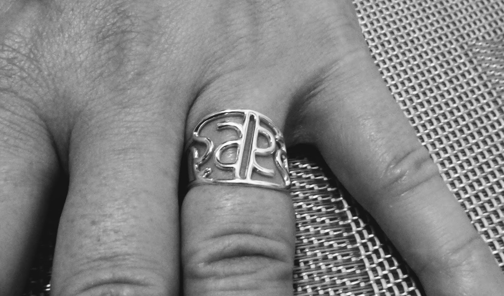
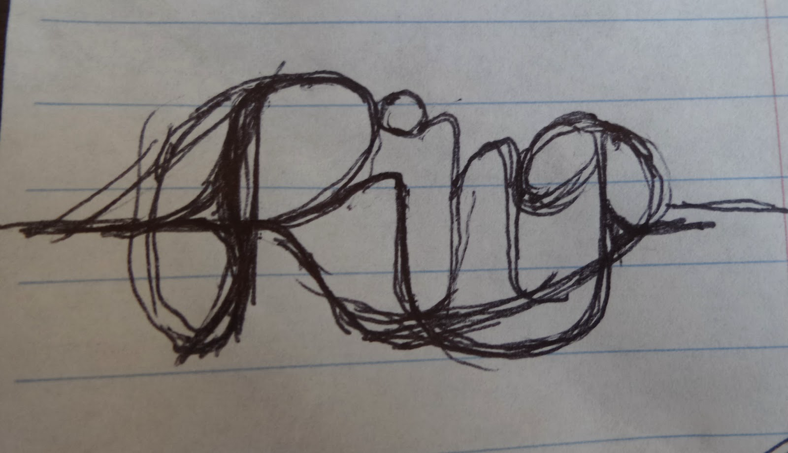
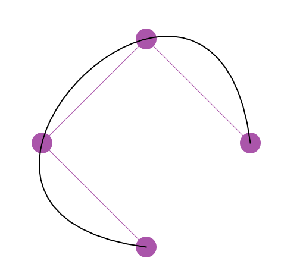
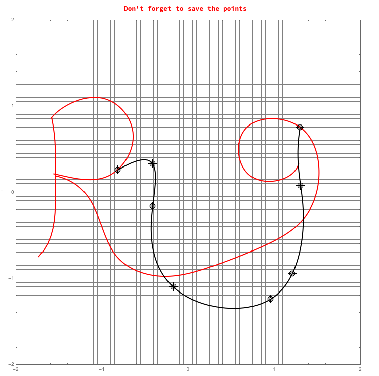
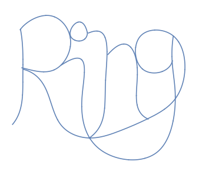
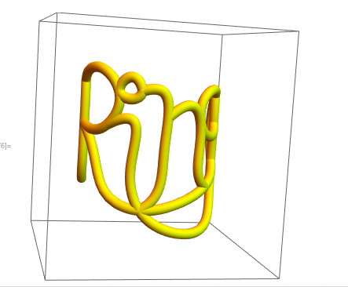
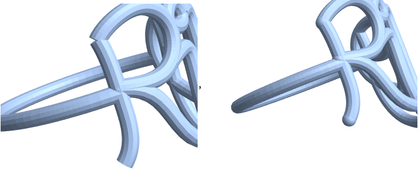
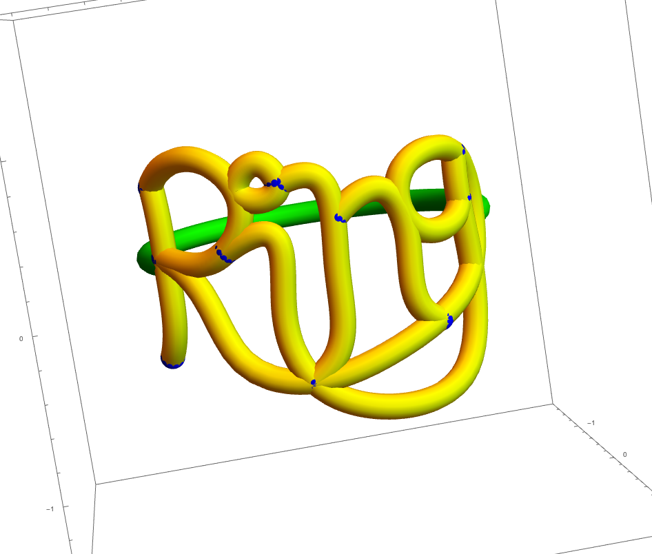
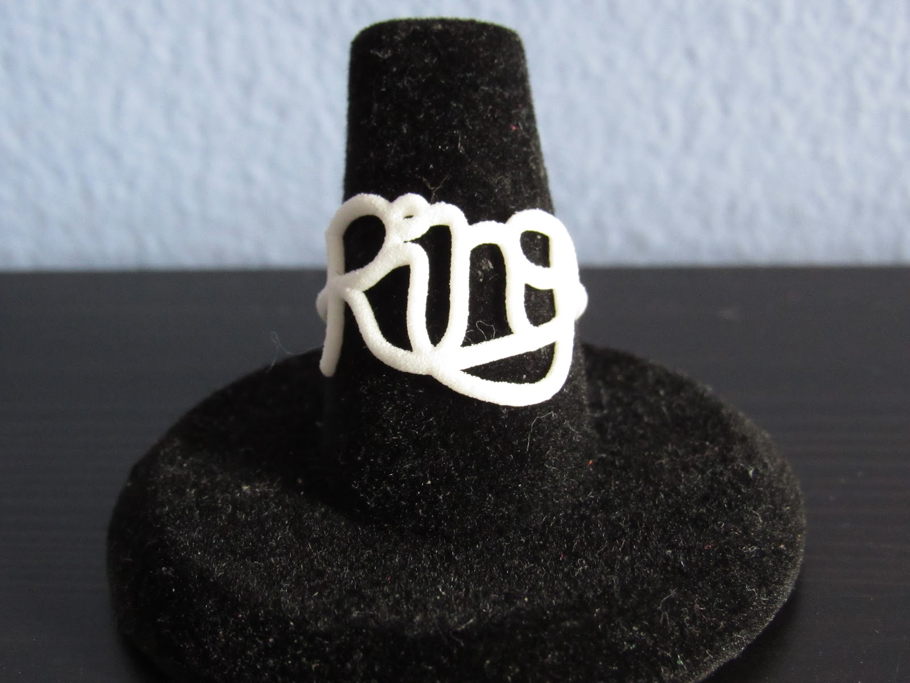

In this post I will be going through the techniques I use to create a name ring in Mathematica.  Here is a ring I designed that is an [ambigram](https://en.wikipedia.org/wiki/Ambigram) of the name Sara.



Click below to interact with a 3D rendering of the ring.

<iframe allowfullscreen="" allowvr="" frameborder="0" width="420" height="300" mozallowfullscreen="true" onmousewheel="" src="https://sketchfab.com/models/e9f0db64faa349cca1486757388ad2ba/embed" webkitallowfullscreen="true" width="640"></iframe>

Since I have never met a meta I didn't like, let's walk through the design of a new ring that says *Ring*.

## Step One: Create a sketch

Create a drawing of the word with an eye toward its style and making sure that the letters have a natural way that they can be connected.  After doing a dozen sketches, I settled on this draft to guide me:



I made sure that the sketch has two disjoint paths from the beginning of the word to the end of the word so that the ring is stronger when it is printed.

## Step Two: Transfer into Mathematica

Our next goal is to convert the drawing into a two-dimensional `Graphics` object in Mathematica.  The relevant Mathematica commands for this are `BSplineFunction`, `BezierFunction`, and `Interpolation`, which take as input a set of points and give a smooth function that follows those points as output.  I've created `BezierFunction`s manually a couple of times which was a painstaking process because the curve does not pass through the chosen points, so this time I figured that I would try to streamline the choosing and adjusting of points.

When researching how to do this, I found a thread about [extruding along a path](http://mathematica.stackexchange.com/questions/3051/extruding-along-a-path) on StackExchange, which led me to a [comment by J.M.](http://mathematica.stackexchange.com/questions/3051/extruding-along-a-path#comment34740_3062) and a link in Mathematica's Documentation Center about how to [create a `BSplineCurve` that touches the control points](http://reference.wolfram.com/language/ref/BSplineCurve.html#968466).  I wrote a function to do this automatically, which I called `SplineIt`.

```{.mathematica}
SplineIt[pts_] := 
 Module[
  {n = Length[pts], dist, param, knots, m, ctrlpts},
  dist = Accumulate[Table[
     EuclideanDistance[pts[[i]], pts[[i+1]]], {i, n-1}]];
  param = N[Prepend[dist/Last[dist], 0]];
    knots = Flatten[{{0, 0, 0, 0}, 
      Table[i/(n-3), {i, 1, n-4}], {1, 1, 1, 1}}];
  m = Table[
   BSplineBasis[{3, knots}, j-1, param[[i]]],
   {i, n}, {j, n}];
  ctrlpts = LinearSolve[m, pts]
]
```

Here I have applied `SplineIt` to the sequence of points $\{(1, 0), (0, 1), (-1, 0), (0, -1)\}$



Then I wanted to move the control points (or add in new ones) and watch the shape of the curves change.  Once again the Documentation Center has a relevant example about an [application of `DynamicModule`](http://reference.wolfram.com/language/ref/DynamicModule.html), which I coupled with another StackExchange answer on [inserting points](http://mathematica.stackexchange.com/questions/118291/insert-new-points-at-specific-places-in-the-locator-pane) in a `DynamicModule` to give the following code that allows us to move points and have a `BSplineCurve` passing through the movable points.

This allowed me to create a streamlined process where I successively created piece after piece of the name plate.

```{.mathematica}
allpts = {};
pts = {{1, 0}, {0, 1}, {-1, 0}, {0, -1}, {1, 0}};
DynamicModule[{i = Length[pts], last},
  last[prev_, curr_] := 
  If[Length[prev] != Length[curr], Length[curr], 
   FirstPosition[SameQ @@@ Thread[{prev, curr}], False][[1]]];
  Column[{Style["Don't forget to save the points", Red, Bold], 
     LocatorPane[
       Dynamic[pts, (i = last[pts, #]; pts = #) &],
       EventHandler[
         Dynamic[Show[
            {Graphics[{
                {Thick, Red, Map[BSplineCurve[SplineIt[#]] &, allpts]},
                {Thick, Black, BSplineCurve[SplineIt[pts]]}
               }, ImageSize -> 700, 
              GridLines -> {Table[i, {i, -1.3, 1.3, .05}], Table[i, {i, -1.3, 1.3, .05}]}, 
              PlotRange -> {{-2, 2}, {-2, 2}}]},
          Frame -> True]],
       {{"MouseDown", 
        2} :> (pts = 
         Insert[pts, MousePosition["GraphicsAbsolute"], i + 1])}],
    LocatorAutoCreate -> True]}, Alignment -> Center]]
```

The variable `pts` keeps track of the current set of points that I am moving and sculpting.  Once I get the points in the right place, I mark down what the current set of points `pts` is and append it to the list `allpts`.  Here is what it looks like part of the way through when I am editing the tail of the G (which is also the bottom of the I):



::: {.callout-tip title="Pro Tip"}
I always tell my students to never break anything that works!  If you get one piece of your code working, copy the whole working block of code into a new cell and modify the new cell.
:::

By the end of the process, my list of `allpts` includes all the pieces of the name plate, including the three parts of the R, the tail of the G, the circle of the I, and the two parts of the N.  This process involves much trial and error to get the points just right.

```{.mathematica}
r1pts = {{-1.592, 0.86}, {-1.328, 1.05}, {-0.786, 0.98}, {-0.64, 
    0.67}, {-0.868, 0.225}, {-1.212, 0.15}, {-1.56, 0.215}};
r2pts = {{-1.586, 0.87}, {-1.55, 
    0.62}, {-1.542, -0.12}, {-1.594, -0.505}, {-1.736, -0.745}};

r3pts = {{-1.534, 0.19}, {-1.238, 
    0.035}, {-1.01, -0.38}, {-0.61, -0.905}, {-0.092, -0.96}, {0.344, \
-0.835}, {0.88, -0.62}, {1.314, -0.335}, {1.518, 0.235}, {1.306, 
    0.75}, {0.676, 0.75}, {0.612, 0.34}, {0.984, 0.13}, {1.282, 
    0.335}};

gpts = {{1.298, 0.755}, {1.304, 
    0.08}, {1.208, -0.945}, {0.956, -1.24}, {-0.172, -1.1}, {-0.412, \
-0.165}, {-0.412, 0.33}, {-0.818, 0.26}};

ipts = {{-0.326, 0.82}, {-0.6, 0.92}, {-0.63, 0.735}, {-0.466, 
    0.67}, {-0.322, 0.81}};

n1pts = {{-0.302, 0.805}, {-0.092, 
    0.83}, {0.018, -0.045}, {-0.096, -0.79}, {-0.278, -0.97}};

n2pts = {{0.064, 0.44}, {0.47, 
    0.585}, {0.61, -0.08}, {0.652, -0.51}, {0.824, -0.655}};

allpts = {r1pts, r2pts, r3pts, gpts, ipts, n1pts, n2pts};
```

With these control points, we get the final two-dimensional graphic.  Not bad!



## Step Three: Convert into three dimensions

Now we need to take the two-dimensional `Graphics` object and make it into a three-dimensional `Graphics3D` object.  We get to use some elementary trigonometry to do this!  The key idea is that we can wrap a two-dimensional picture around a cylinder of radius 1 by taking a point at $(x,y)$ on the plane to a point $(\sin(x),y,\cos(x))$ on the cylinder.

First I use a technique from a [discussion on StackExchange](http://mathematica.stackexchange.com/questions/19229/convert-bsplinefunction-into-two-interpolating-functions?rq=1) to define the $x$- and $y$-components of the `BSplineCurve` commands we defined above.

```{.mathematica}
xComponent[t_?NumericQ, f_] := 
   Module[{val}, val = f[t]; First@val];

yComponent[t_?NumericQ, f_] := 
   Module[{val}, val = f[t]; Last@val];
```

This means that we can recreate the two-dimensional curves shown above using `ParametricPlot` commands.  Note to do that we have to convert our `BSplineCurve` commands to `BSplineFunction` commands, as shown here.

```{.mathematica}
fcns = Map[ BSplineFunction[SplineIt[#]] &, allpts];
ParametricPlot[{
  Table[{
   xComponent[t, fcns[[i]]], 
   yComponent[t, fcns[[i]]]
   }, {i, Length[fcns]}], 
  {t, 0, 1}, 
 AspectRatio -> 1, PlotRange -> {-1.8, 1.8}, Axes -> False]
```

To wrap these two-dimensional functions around a three-dimensional cylinder of a given radius, we first scale the $x$-components so that they fit in the range between $-\pi/2$ and $\pi/2$, and take the sine and cosine of this times the given radius as the 3D $x$- and $z$-components, respectively.

We combine all the curves together using the `Table` command and use a technique I learned from [a very useful article](http://www.ms.unimelb.edu.au/~segerman/papers/3d_printed_visualisation.pdf) by [Henry Segerman](http://www.segerman.org/) to give these curves a specified thickness by way of the `Tube` command in the `PlotStyle` option.

```{.mathematica}
xscale = 1.5; 
radius = 1.1;
thickness = .08; 
ParametricPlot3D[
  Table[{
   radius * Sin[xComponent[t, fcns[[i]]]/xscale * Pi/2],
   yComponent[t, fcns[[i]]],
   radius * Cos[xComponent[t, fcns[[i]]]/xscale * Pi/2]},
   {i, 1, Length[fcns]}],
  {t, 0, 1}, AspectRatio -> 1, PlotRange -> {-1.8, 1.8}, 
 PlotStyle -> {Tube[thickness], Yellow}]
```



## Step Four: Add finishing touches

We now have a virtual three-dimensional version of the name plate from our original sketch, and need to do some finishing work before it is ready to be printed.  We will add the strap that goes behind the finger and add a sphere to every curve endpoint.

You can add the strap in multiple ways depending on the style you are going for.  For example, the Sara ring above has two straps that cross in an X behind the finger.  For this ring, I have decided to make a single strap connecting the beginning and the end of the name plate.  All this requires is a part of a circle of given radius which I have placed at height $y=0.1$ to line up well.  The range on $t$ is determined by trial and error.

```{.mathematica}
ParametricPlot3D[
  {radius*Sin[t + Pi], 0.1, radius*Cos[t + Pi]},
  {t, -Pi/2 - .46, Pi/2 + .45}, 
   AspectRatio -> 1, PlotRange -> {-1.8, 1.8}, 
   PlotStyle -> {{Tube[thickness], Green}}]
```

If we were to export the file right now, we would be in for an unwelcome surprise!  The exported file would not have the nice rounded ends of the curves like in the Mathematica notebook, so we need to add them manually.  Compare before and after shots of the exported files:



Luckily this is not too difficult with Mathematica's `Map` function.  We tell Mathematica to choose the first and last points of every letter piece, and then tell Mathematica to put a sphere at the transformed image of these points.  I also like to give the spheres a different color in order to see them distinctly on the image.

```{.mathematica}
sphereposns = 
   Flatten[{ptslist[[All, 1]], ptslist[[All, -1]]}, 1];
Graphics3D[{Blue, 
    Map[Sphere[{radius*Sin[#[[1]]/xscale*Pi/2], #[[2]], 
      radius*Cos[#[[1]]/xscale*Pi/2]}, thickness] &,
   sphereposns]}]
```

::: {.callout-tip title="Pro Tip"}
The `PlotStyle->Tube` option and `Sphere` command have acceptable resolution because a ring is a small object.  When you want to export a larger sphere (2 in / 5 cm) or a larger curved tube, instead you would need to use a `ParametricPlot3D` command involving multiple variables in order to specify the exporting resolution.
:::

By combining all the pieces we have programmed, our virtual ring is complete!

```{.mathematica}
SplineIt[pts_] := 
 Module[
  {n = Length[pts], dist, param, knots, m, ctrlpts},
  dist = Accumulate[Table[
     EuclideanDistance[pts[[i]], pts[[i+1]]], {i, n-1}]];
  param = N[Prepend[dist/Last[dist], 0]];
    knots = Flatten[{{0, 0, 0, 0}, 
      Table[i/(n-3), {i, 1, n-4}], {1, 1, 1, 1}}];
  m = Table[
   BSplineBasis[{3, knots}, j-1, param[[i]]],
   {i, n}, {j, n}];
  ctrlpts = LinearSolve[m, pts]
]
xComponent[t_?NumericQ, f_] := 
   Module[{val}, val = f[t]; First@val];

yComponent[t_?NumericQ, f_] := 
   Module[{val}, val = f[t]; Last@val];


 
r1pts = {{-1.592, 0.86}, {-1.328, 1.05}, {-0.786, 0.98}, {-0.64, 
    0.67}, {-0.868, 0.225}, {-1.212, 0.15}, {-1.56, 0.215}};
r2pts = {{-1.586, 0.87}, {-1.55, 
    0.62}, {-1.542, -0.12}, {-1.594, -0.505}, {-1.736, -0.745}};
r3pts = {{-1.534, 0.19}, {-1.238, 
    0.035}, {-1.01, -0.38}, {-0.61, -0.905}, {-0.092, -0.96}, {0.344, \
-0.835}, {0.88, -0.62}, {1.314, -0.335}, {1.518, 0.235}, {1.306, 
    0.75}, {0.676, 0.75}, {0.612, 0.34}, {0.984, 0.13}, {1.282, 
    0.335}};
gpts = {{1.298, 0.755}, {1.304, 
    0.08}, {1.208, -0.945}, {0.956, -1.24}, {-0.172, -1.1}, {-0.412, \
-0.165}, {-0.412, 0.33}, {-0.818, 0.26}};
ipts = {{-0.326, 0.82}, {-0.6, 0.92}, {-0.63, 0.735}, {-0.466, 
    0.67}, {-0.322, 0.81}};
n1pts = {{-0.302, 0.805}, {-0.092, 
    0.83}, {0.018, -0.045}, {-0.096, -0.79}, {-0.278, -0.97}};
n2pts = {{0.064, 0.44}, {0.47, 
    0.585}, {0.61, -0.08}, {0.652, -0.51}, {0.824, -0.655}};
allpts = {r1pts, r2pts, r3pts, gpts, ipts, n1pts, n2pts};

 
xscale = 1.5; 
radius = 1.1;
thickness = .08; 
stretch = .7;
ptslist = stretch * allpts;
sphereposns = 
    Flatten[{ptslist[[All, 1]], ptslist[[All, -1]]}, 1]
fcns = Map[BSplineFunction[SplineIt[#]] &, ptslist];
Show[
  ParametricPlot3D[
    Table[{
        radius*Sin[xComponent[t, fcns[[i]]]/xscale*Pi/2],
        yComponent[t, fcns[[i]]],
        radius*Cos[xComponent[t, fcns[[i]]]/xscale*Pi/2]},
      {i, 1, Length[fcns]}], 
   {t, 0, 1}, AspectRatio -> 1, PlotRange -> {-1.8, 1.8}, 
   PlotStyle -> {Tube[thickness], Yellow}], 
  ParametricPlot3D[{
   {radius*Sin[t + Pi], 0.1, radius*Cos[t + Pi]}},
   {t, -Pi/2 - .46, Pi/2 + .45}, 
    PlotStyle -> {{Tube[thickness], Green}}],
  Graphics3D[{Blue, 
    Map[Sphere[{radius*Sin[#[[1]]/xscale*Pi/2], #[[2]], 
      radius*Cos[#[[1]]/xscale*Pi/2]}, thickness] &,
   sphereposns]}]
]
```



## Step Five: Send to the printer!

Once you are happy with your virtual ring, you'll need to print it out.  I send my files to [Shapeways](http://www.shapeways.com/), which is also located in Queens, NY. ([I've taken my students there!](https://plus.google.com/+ChristopherHanusa/posts/iukm2iugqci)) I highly suggest printing a prototype first, probably in White Strong and Flexible Plastic since it is the fastest and cheapest material.  This will help to make sure the ring is the right size and looks the way you want it to before printing it in higher-quality (and much more expensive) materials.

Mathematica 11 has built in the capability to upload your model directly to Shapeways using the command [`Printout3D`](https://www.wolfram.com/language/11/3d-printing/send-your-models-to-3d-printing-service-providers.html), but I still prefer using `Export` in order to have a copy of the exported .STL file on my own computer. I always like to put the STL file in the same directory as the Mathematica file I am working with, so I use the following command.

```{.mathematica}
Export[NotebookDirectory[] <> "MetaRing.stl", %]
```

Now [Go to Shapeways](http://www.shapeways.com) and click the Upload button on the top right.  Choose your model, and click the Inches option.  After the file uploads, you'll need to resize the file so that the ring is the correct size, which you can measure on the desired finger and compare against the size Shapeways gives.  Realize that your finger will need to fit on the *inside* of the ring, while Shapeways is displaying the size of the *outside* of the ring.

Shapeways will go through its preliminary set of checks on your ring and let you know what in materials your model is able to be printed.  Even though you may be only printing your first prototype in White Strong and Flexible Plastic, make sure that your model also gets the green checkmark in the *final material* that you want to print it.

Order your ring, wait *VERY* patiently, and when it arrives check to see if it looks the way you want.



  If it does not, you'll need to re-edit your Mathematica file (perhaps changing the thickness of the tubes, and/or the position of the control points) or resize the file on the Shapeways website.  In either case, Shapeways will have one more say about whether the new model is printable.  Go through the prototyping phase once more if the changes are drastic (or even not-so-drastic).  Once you are sure that your ring is the way you want it to be, order the final version in the material you think it will look best. (The Sara ring above is printed in Premium Silver, and it is stunning!)

**Good luck!  Let me know how it turns out.**

:::: {style="text-align: center;font-size:110%;"}

Christopher Hanusa's portfolio is available online at

[](http://hanusadesign.com)

Purchase a copy of this and other 3D printed artwork

at [Hanusa ≀ Design on Shapeways](https://www.shapeways.com/shops/mathartshop).

I also design custom jewelry.  Email (hanusadesign - AT - gmail.com) for more details.

::::
