Today I continue my series of Mathematica Tutorials for 3D printing.  Last time I showed how to create a [custom-designed name ring](../2017-03-01-3d-design-in-mathematica-creating-a-name-ring/index.qmd).  In this post I will discuss how to design a polyhedral terrarium.  You may have noticed that geometric objects are very fashionable these days.  A quick Google Image search for [Geometric Terrarium](https://www.google.com/search?q=geometric+terrarium&tbm=isch) gives a wide variety of styles and manufacturers.

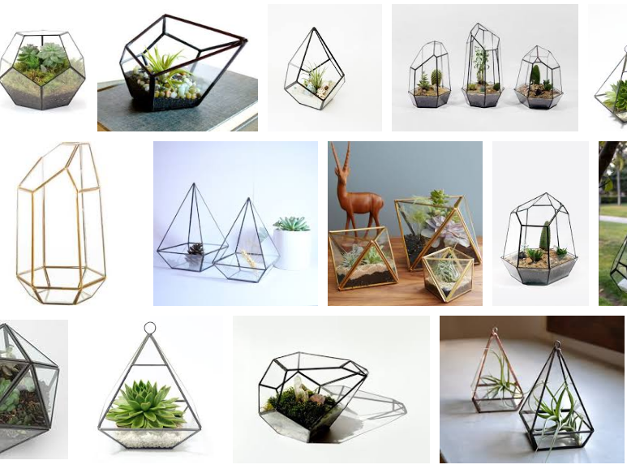

We're going to make our own terrarium using Mathematica.  I'm inspired to write about this because I'm giving a talk in May at [Construct3D](https://www.construct3d.org/) about 3D printing techniques in Mathematica that I teach my students, and this is a case in point—my student Isaac Deonarine used similar techniques to create a Dodecahedral Terrarium.  Click here to interact with a 3D rendering of his work:

<iframe allowfullscreen="" allowvr="" frameborder="0" height="300" mozallowfullscreen="true" onmousewheel="" src="https://sketchfab.com/models/50b8664da80b41dd9034740d359f58a0/embed" webkitallowfullscreen="true" width="420"></iframe>

or see the [Geometric Terrarium at Shapeways](http://shpws.me/Od8w). Now, on to the tutorial!

## Step One: Choose a Polyhedron

The Mathematica team curated a large amount of polyhedra that can be accessed using the command `PolyhedronData`. The full list of 195 entries can be accessed using the command `PolyhedronData[All]`, and all 195 polyhedra can be visualized by typing

```{.mathematica}
Map[PolyhedronData, PolyhedronData[All]]
```

Alternatively, Mathematica's thorough Documentation Center suggests using the code

```{.mathematica}
Manipulate[

 Column[{PolyhedronData[g], PolyhedronData[g, p]}], 

  {g, PolyhedronData[All]}, 

  {p, Complement @@ PolyhedronData /@ {"Properties", "Classes"}}

]
```

to generate an interactive interface for navigating the data:

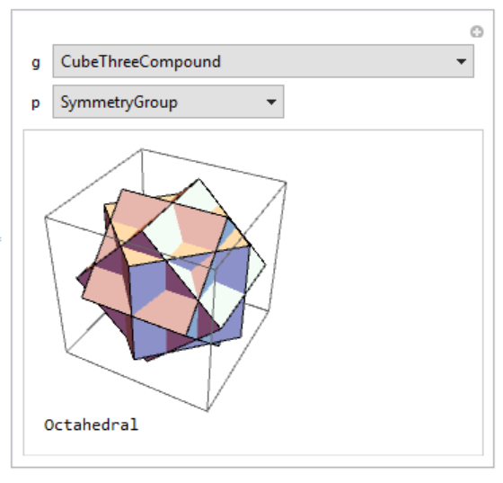

I've chosen to work with the [Snub Cube](https://en.wikipedia.org/wiki/Snub_cube).

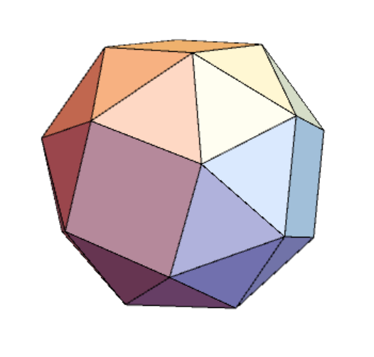

The snub cube is one of my favorite polyhedra because it has [chirality](https://en.wikipedia.org/wiki/Chirality_(mathematics))—there are two distinct snub cubes based on the way it is built— (also an important [concept in chemistry](https://en.wikipedia.org/wiki/Chirality_(chemistry))...) and because it [cannot be built](http://www.georgehart.com/virtual-polyhedra/zometool.html) using the mathematical building blocks [ZomeTools](https://en.wikipedia.org/wiki/Zome)!

## Step Two: Develop the schematics

Now let's gather some data about snub cubes. It is useful to know the coordinates of the vertices, the pairs of vertices that form the edges, and faces of the polyhedron.  These are all simple to request.

```{.mathematica}
vertices = N@PolyhedronData["SnubCube", "VertexCoordinates"]

edges = N@PolyhedronData["SnubCube", "Edges"]

faces = N@PolyhedronData["SnubCube", "Faces"]
```

The `N@` prefix asks for numerical approximations of these coordinates so that we are not dragging around the exact coordinates which involve roots of the polynomial \[32 x^6-32 x^4-12 x^2-1.\]

**Fun Fact:** [N@](http://www.pittsburghese.com/glossary.ep.html?type=other) is also a colloquialism from Pittsburgh, PA, where I grew up.  It is a filler that means "and so on" and might be used in a sentence such as "Yinz goin' dahntahn n'at?".

What I would like to do is to remove some of the faces.  If you look at the structure of the faces variable, you see that it is a `GraphicsComplex` object listing its coordinates and the list of vertices involved in each face.  A very helpful thing to do is to put the labels of the vertices on the vertices to understand how the polyhedron is constructed. We can do that by putting the vertex index at the coordinates of the vertex.

```{.mathematica}
coords = faces[[1]]

facelist = faces[[2, 1]]

Graphics3D[{

   Table[Text[Style[i, Large], verts[[i]]], {i, Length[verts]}],

   GraphicsComplex[coords, Polygon@facelist]

}, Boxed -> False]
```

which looks like this:

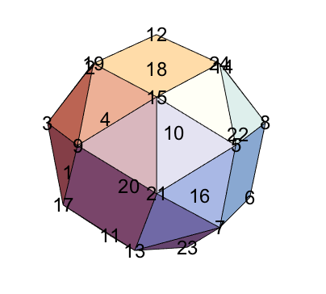

The variable `facelist` contains the list of vertices for each of the polygons:

```{.mathematica}
{{3, 1, 17}, {3, 17, 9}, {3, 19, 2}, {3, 9, 19}, {1, 4, 20}, {1, 20, 11}, {1, 11, 17}, {2, 19, 12}, {2, 18, 4}, {2, 12, 18}, {4, 18, 10}, {4, 10, 20}, {17, 11, 13}, {19, 9, 15}, {18, 12, 14}, {20, 10, 16}, {9, 21, 15}, {11, 23, 13}, {12, 24, 14}, {10, 22, 16}, {13, 23, 7}, {13, 7, 21}, {15, 21, 5}, {15, 5, 24}, {16, 22, 6}, {16, 6, 23}, {14, 24, 8}, {14, 8, 22}, {21, 7, 5}, {23, 6, 7}, {24, 5, 8}, {22, 8, 6}, {1, 3, 2, 4}, {21, 9, 17, 13}, {24, 12, 19, 15}, {10, 18, 14, 22}, {11, 20, 16, 23}, {8, 5, 7, 6}}
```

For example, in the above figure you can see the triangular face with vertices {3, 17, 9} on the left and the square face with vertices {8, 5, 7, 6} on the right.

I am going to define some vertex sets in order to simplify some future commands.  Let's define the sets of vertices on the top and bottom faces of the snub cube and the vertices on the upper and lower halves of the snub cube.

```{.mathematica}
topvs = {12, 15, 19, 24};

bottomvs = {16, 20, 11, 23};

uppervs = Quiet@Flatten@Position[vertices, _?(#[[3]] > 0 &)];

lowervs = Quiet@Flatten@Position[vertices, _?(#[[3]] < 0 &)];
```

I'd like to only keep the faces at the bottom of the snub cube, which I could have done by hand, but because of the previous definitions, I can calculate algorithmically by asking which faces in `facelist` do not contain any of the vertices in the upper half:

```{.mathematica}
newfacelist = Select[facelist, Intersection[uppervs, #] == {} &]

Graphics3D[{

   GraphicsComplex[coords, Polygon@newfacelist]

}, Boxed -> False]
```

which looks like this:

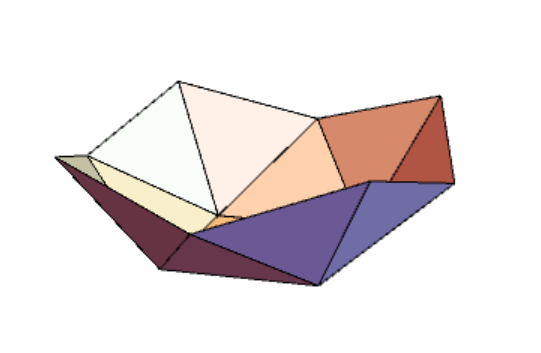

When we removed the faces, we also removed the incident edges, and I'd like to add many of them back in.  In particular, I'd like to reinsert the lost edges that are not are not touching the top face and also not edges of the faces of the base.

```{.mathematica}
lostedges = Select[edgelist, 

  (Length@Intersection[lowervs, #] < 2 && 

   Length@Intersection[topvs, #] == 0) &]

Graphics3D[{

  GraphicsComplex[coords, Polygon@newfacelist],

  Thick, GraphicsComplex[coords, Line@lostedges]

}, Boxed -> False]
```

This code yields the following image.  The basic structure of our terrarium is finally coming in view!

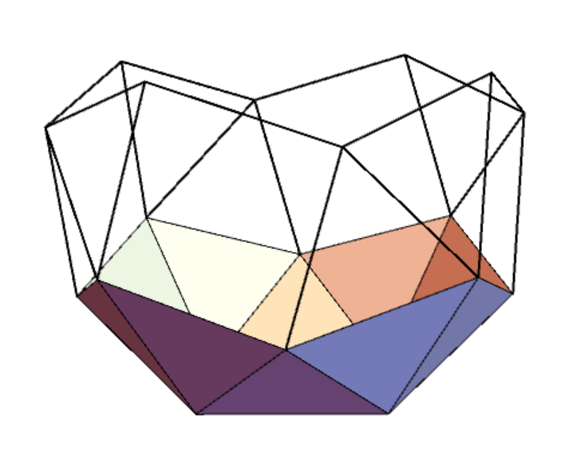

## Step Three: Make it 3D printable

The structure of what we want to 3D print is there, but we can't print it because each face is only two-dimensional and each edge is only one-dimensional!  So we'll need to add some thickness to the faces and the edges.  In fact, we won't be adding thickness to a face as much as we will be constructing a new solid that has two layers of faces.  We will be generating a new `GraphicsComplex` object, which means we need to mark down all vertices that form the corners of our object, and keep track of which of these vertices are connected to form the polygonal faces.

Just like blowing up a balloon appears to dilate the surface of the balloon by a constant factor, we can create an outer layer of faces 10% bigger than the original faces by multiplying all coordinates by a factor of 1.1; we save these coordinates as `dilatedcoords`.  Thinking of the original vertices as vertices 1 through 24, we consider these dilated vertices to be vertices 25 through 48; furthermore, they have the exact same incidences as the vertices 1 through 24.  So determining the vertex indices in the list of dilated faces is as simple as adding 24 to the index of each of the original vertices.

```{.mathematica}
dilatedcoords = 1.1 coords;

dilatedfacelist = newfacelist + 24;

allcoords = Join[coords, dilatedcoords];

allfaces = Join[newfacelist, dilatedfacelist];

Graphics3D[{GraphicsComplex[allcoords, Polygon@allfaces]}, Boxed -> False]
```

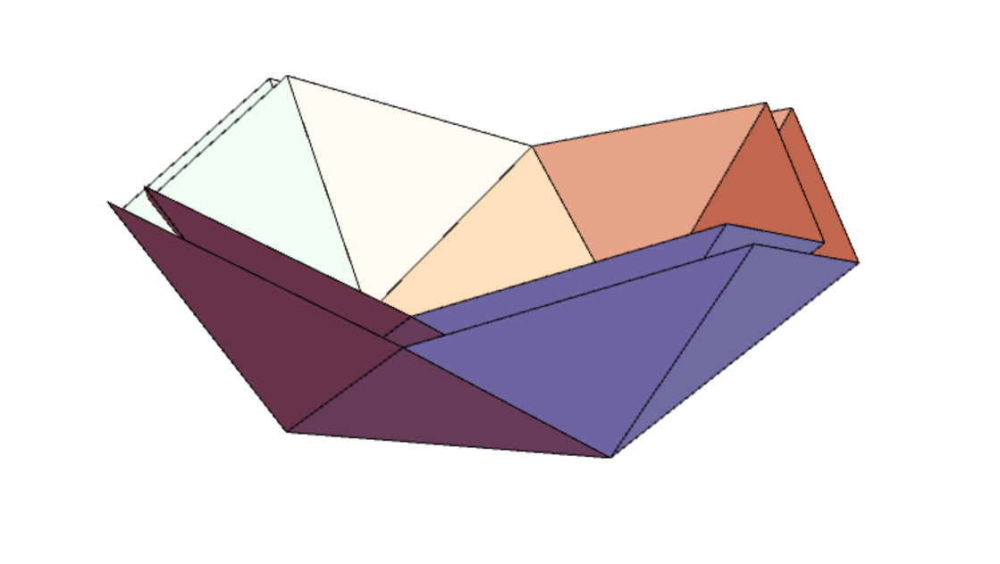

Combining the original and dilated coordinates and faces gives the inner and outer shell of polygonal faces, but this is not a closed object.  We also need to complete the base by adding in quadrilaterals that bridge the shells.  To do this, we (manually) keep track of the indices of the original vertices that work around the boundary of the base.  The quadrilaterals we create need to join two adjacent boundary vertices with their dilates (remember they are indexed by 24 more than their non-dilated counterparts.

```{.mathematica}
boundaryedges = {{1, 17}, {17, 13}, {13, 7}, {7, 6}, {6, 22}, {22, 10}, {10, 4}, {4, 1}};

boundaryfaces = Map[

  {#[[1]], #[[2]], #[[2]] + 24, #[[1]] + 24} &, 

  boundaryedges];

Graphics3D[{

   GraphicsComplex[allcoords, Polygon@allfaces],

   GraphicsComplex[allcoords, Polygon@boundaryfaces]

}, Boxed -> False]
```

Putting these all together gives the base; we visualize the result:

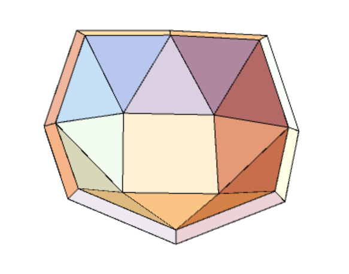

Now we need to construct the three dimensional version of the edges.  I want to make thin cylindrical edges for the black lines on the sketch above, and I also want to curve the top of each of the boundary edges to soften the edges.  I introduced some parameters to be able to play around with them to work out the best visualization.  The value `midpt` is the coordinate multiplier.  It is 1.05 since that is halfway between the original coordinate (multiplier 1.0) and the dilated coordinate (multiplier 1.1).  The big radius is the radius of the cylinder along the `boundary edges'.  I was originally surprised that .05 was not the correct value here.  The small radius is the radius of the cylinder along the `lost edges' (the black lines above). `Map` then puts a `Tube` (cylinder) along each of those edges at the specified radii.

```{.mathematica}
midpt = 1.05; bigr = .0615; smallr = .04;

tubes = Join[

    Map[Tube[#, bigr] &, 

      Table[midpt {coords[[boundaryedges[[i, 1]]]], 

          coords[[boundaryedges[[i, 2]]]]},

    {i, Length[boundaryedges]}]],

    Map[Tube[#, smallr] &, 

      Table[midpt {coords[[lostedges[[i, 1]]]], 

          coords[[lostedges[[i, 2]]]]}, 

   {i, Length[lostedges]}]]

];
```

Just as when we constructed the [name ring](../2017-03-01-3d-design-in-mathematica-creating-a-name-ring/index.qmd), we need to finish the cylinders with spheres at each endpoint.  We need spheres of the same radius as the radius of the adjacent cylinders.

```{.mathematica}
spheres = {

  Map[Sphere[#, bigr] &, 

   midpt coords[[Complement[lowervs, bottomvs]]]], 

  Map[Sphere[#, smallr] &, 

   midpt coords[[Complement[uppervs, topvs]]]]

}
```

Now put everything together and export the model to an STL file.

```{.mathematica}
terrarium = Graphics3D[{

    GraphicsComplex[allcoords, Polygon@allfaces],

    GraphicsComplex[allcoords, Polygon@boundaryfaces],

    tubes, spheres

}, Boxed -> False]

Export[NotebookDirectory[] <> "terrarium.stl", terrarium]
```

After exporting, we can upload it where we need to.  I've uploaded it to Sketchfab so you can play with a rendering of the final product!

<iframe allowfullscreen="" allowvr="" frameborder="0" height="300" mozallowfullscreen="true" onmousewheel="" src="https://sketchfab.com/models/4183d3ba8f2943878aa7e4cb683e47e0/embed" webkitallowfullscreen="true" width="420"></iframe>

## Step Four: Send to the printer!

Now let's print out the model!  (Note that I provide much more detail on the prototyping and printing processes at the bottom of the [name ring design post](../2017-03-01-3d-design-in-mathematica-creating-a-name-ring/index.qmd).)

I highly suggest a final print of your terrarium in glazed ceramic because it will be able to withstand the elements and the cleaning required by dirt and plants.  At the same time, I would also suggest prototyping on a local 3D printer instead of prototyping through Shapeways.  At 4.5 inches by 4.5 inches by 3.5 inches, a basic print is already approaching $60!  I printed it on the Lulzbot Mini printer that my colleague in the Queens College Art department is graciously loaning me, and, after 9 hours of printing, here is the stunning result:  (click to zoom)

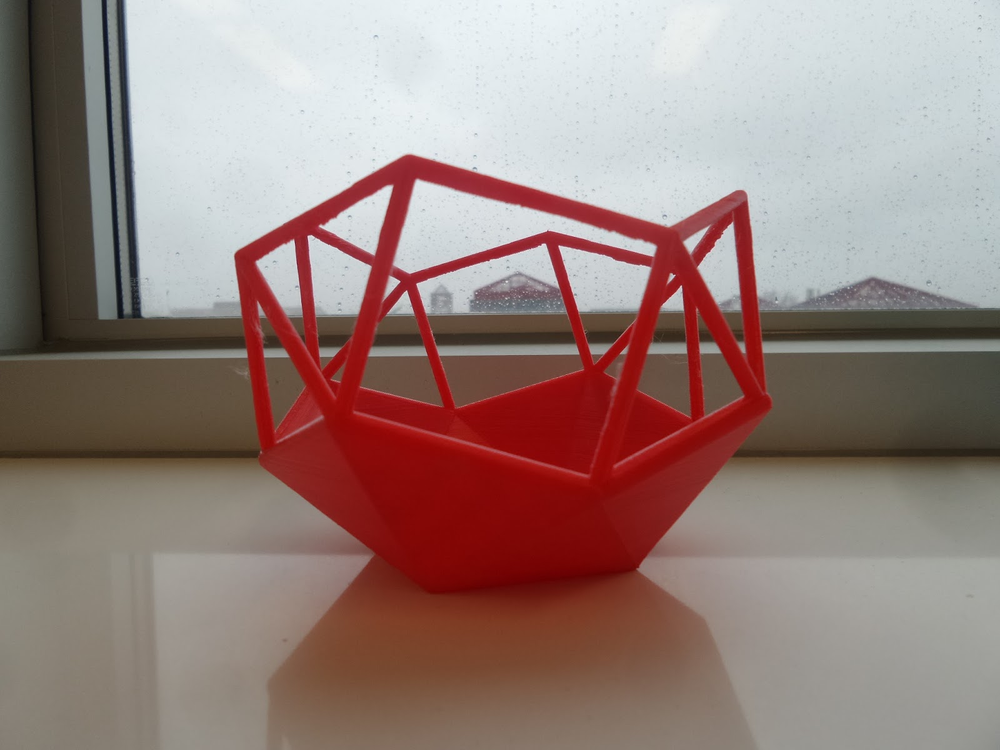

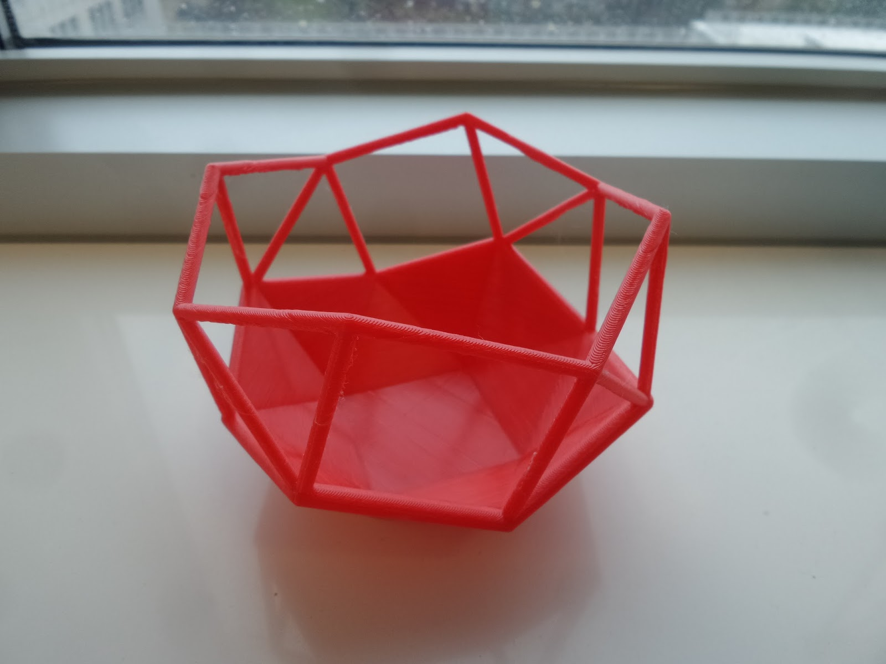

::: {.callout-tip title="Pro Tip"}
The standard Cura software that comes with the Lulzbot was not able to correctly process my file—it either completely fills in the bottom half of the model or does not connect the edges together.  So I needed to do some post-processing of the STL file.  I uploaded it to Netfabb's online STL repair service and the Lulzbot was able to print the STL output from there with no issues.
:::

Shapeways has produced a rendering of what it anticipates that a glazed ceramic version of my file will look like.

[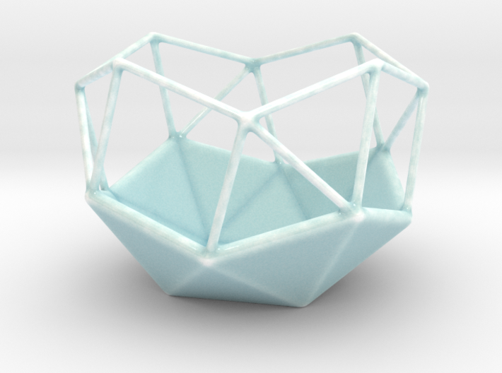](http://shpws.me/OlGj)

I can't wait to get one for myself and house some succulents inside.  If you do your own modifications, do let me know how it turns out.  Until next time!

:::: {style="font-size: 110%; text-align: center;"}

Christopher Hanusa's portfolio is available online at

[](http://hanusadesign.com)

Purchase a copy of this and other 3D printed artwork

at [Hanusa ≀ Design on Shapeways](https://www.shapeways.com/shops/mathartshop).

::::
