Hi everyone!  Welcome back to another 3D Design in Mathematica Tutorial.  Last time I showed how to create a [polyhedral terrarium](../2017-04-03-3d-design-in-mathematica-polyhedral-terrarium/index.qmd).  Today I will use Mathematica's `MeshRegion` command to design a keychain shaped like a country.  I had the opportunity to visit Costa Rica in February and especially enjoyed my visit to the cloud forests of [Monteverde](https://en.wikipedia.org/wiki/Monteverde), so let's choose Costa Rica for our example.

[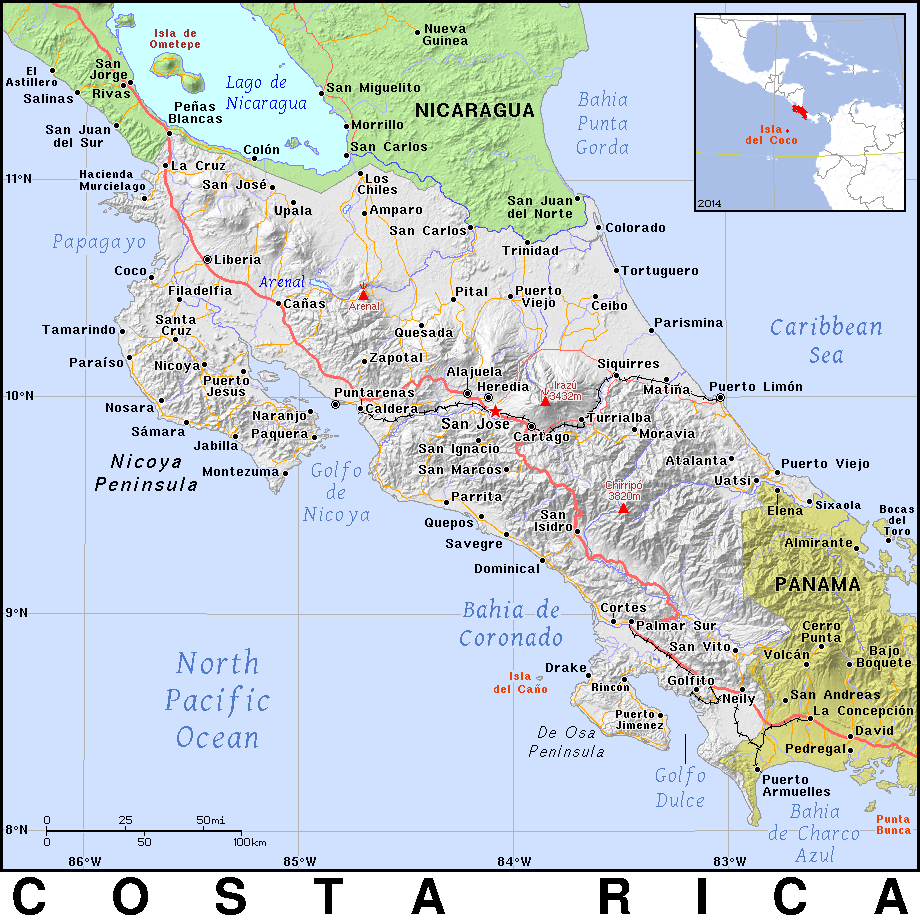](http://ian.macky.net/pat/map/cr/cr.html)

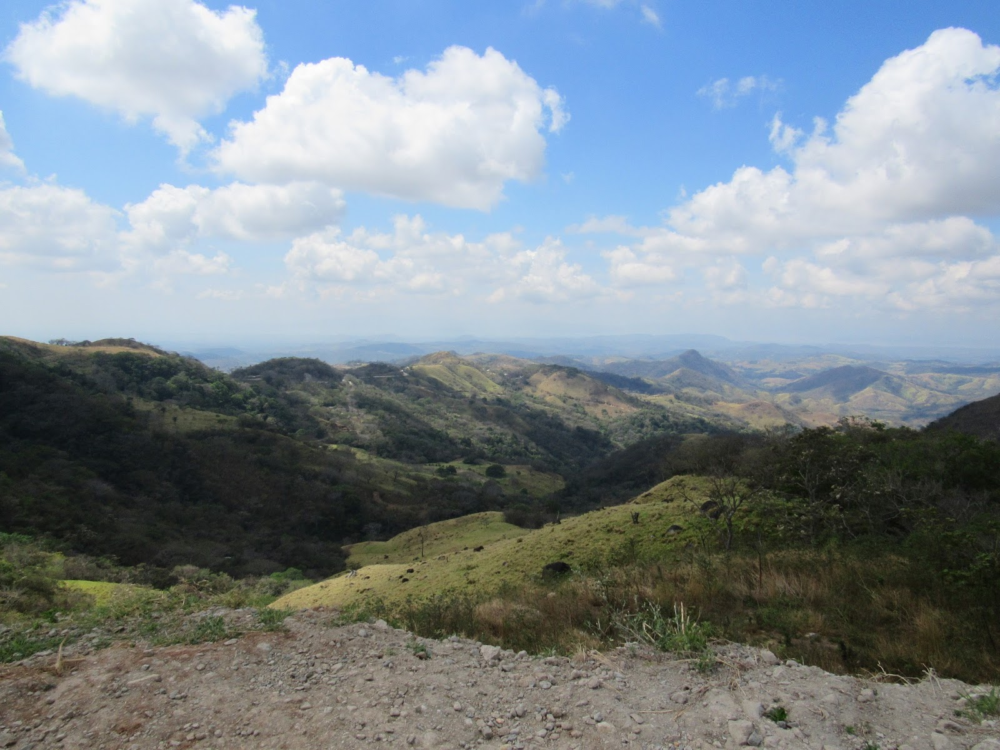

## Step One: Import the shape of Costa Rica

We'll be relying on one of the strengths of Mathematica and the whole Wolfram suite—its vast amount of [curated data](https://reference.wolfram.com/language/howto/UseCuratedData.html).  The command `[CountryData](http://reference.wolfram.com/language/ref/CountryData.html)` can access diverse information about countries such as their GDP, their population, their borders, their languages, and even their flags.

For instance, we can access the shape of Costa Rica by using the following command.

```{.mathematica}
CountryData["CostaRica", "Shape"]
```

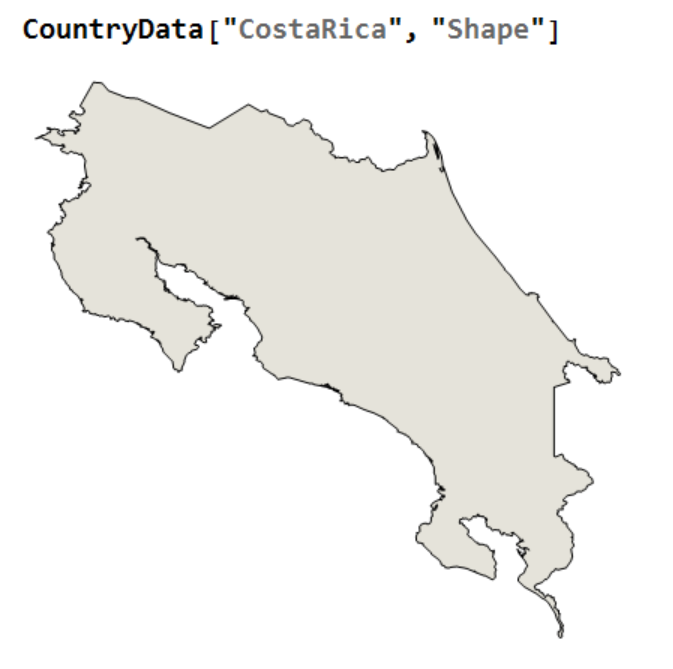

What we would really like are the coordinates of the vertices of this shape, which we can acquire using the command

```{.mathematica}
vertices = 

      CountryData[Entity["Country", "CostaRica"], "Polygon"][[1, 1, 1]];
```

The first few elements of this list are

```{.mathematica}
{{11.0785, -85.6911}, {11.2142, -85.6144}, {11.21, -85.5642}, 
  {11.1667, -85.5264}, ...
```

which are the longitude and latitude of each of the coordinates.

## Step Two: Simplify the boundary

Keeping an eye toward printability, I realized that Costa Rica's actual land and sea borders are too complicated to be able to be printed in metal.  (Shapeways has certain tolerances that must be adhered to for them to accept your file.)  So I needed to find a way to smooth the border to reduce the complexity.  After searching around for quite a while, I learned about a couple well-known simplification algorithms
including [Mike Bostock](https://bost.ocks.org/mike/)'s awesome [visualization](https://bost.ocks.org/mike/simplify/) implementing the [Visvalingam-Whyatt algorithm](https://hydra.hull.ac.uk/resources/hull:8338).

I found this [list of implementations](https://github.com/mourner/simplify-js) of Mike's simplify code and was able to run the python implementation [on repl.it](https://repl.it/HX04/1).  I needed to take the data from Mathematica and put it into the right python format to input into simplify, which would take a pair of coordinates `{11.0785, -85.6911}` and output them as the string `{'x':11.0785, 'y':-85.6911}`.  So I used Mathematica's String operations.

```{.mathematica}
StringJoin @@ 
  Map["{'x':" <> ToString[#[[1]]] <>
     ", 'y':" <> ToString[#[[2]]] <> 
    "}," &, vertices]
```

I input the resulting code:

```{.mathematica}
[{'x':11.0785, 'y':-85.6911}, {'x':11.2142, 'y':-85.6144}, ... ,   {'x':11.0782, 'y':-85.6907}]
```

into simplify with the parameter 0.05.  The output was again in python format, which I needed to reconvert into Mathematica format by deleting extraneous characters:

```{.mathematica}
StringDelete[StringDelete[newpoints, "'y':"], "'x':"]
```

We can compare the before and after of this process:

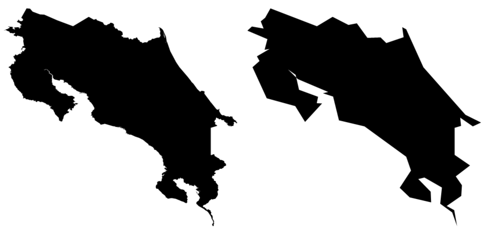

Notice that there are still some jagged parts of the polygon, so I decided to make a few manual adjustments too.  The best way I have found to do this is to use the `ToolTip` command

```{.mathematica}
Graphics[{Polygon@simplified, Red, 
  Map[Tooltip[Point@#, #] &, simplified]}]
```

which displays a vertex's coordinates when you hover over it so that I know I am removing the correct vertices.

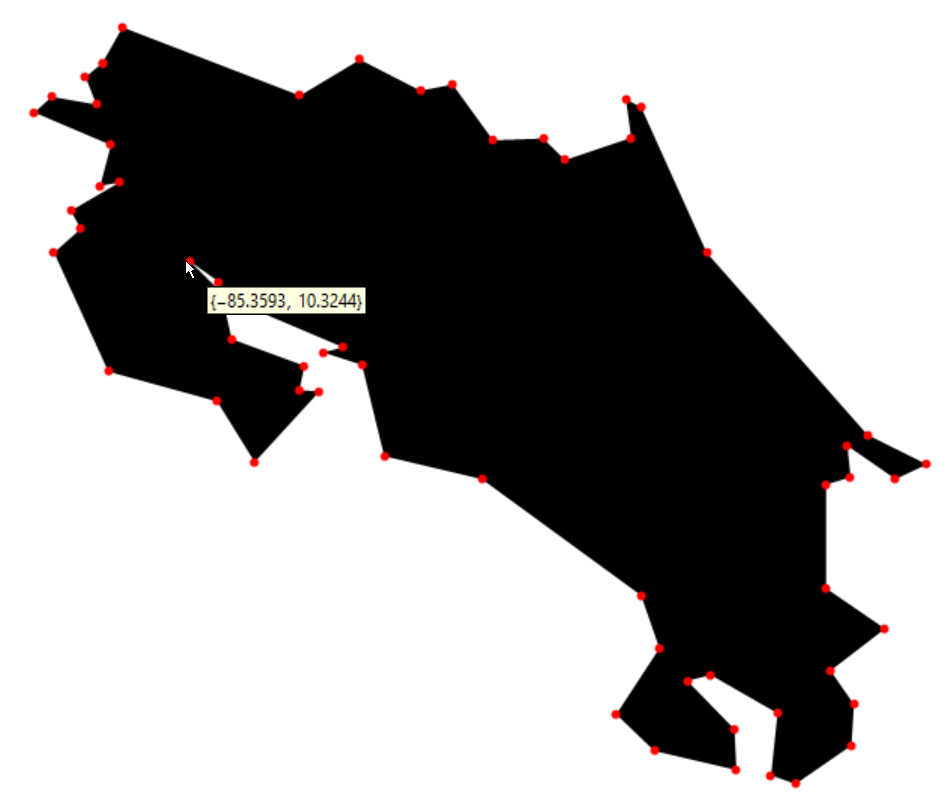

By the end of this process, I had reduced the original polygon with over 1400 vertices to a polygon with 55 vertices that still contains the essence of the shape of Costa Rica.

```{.mathematica}
simplified = {{ -85.6911,  11.0785}, { -85.6144, 11.2142}, { -84.9387,  10.9541}, { -84.7104, 11.091}, { -84.4801,  10.973}, { -84.3577,  10.9965}, { -84.2041, 10.7839}, { -84.0131,  10.7908}, { -83.9293,  10.7087}, { -83.6779,  10.7938}, { -83.6978,  10.8801}, { -83.6401,  10.9096}, { -83.3902,  10.3557}, { -82.7786,  9.66272}, { -82.62,  9.57017}, { -82.6712, 9.49412}, { -82.8549,  9.57112}, { -82.9361,   9.47312}, { -82.9359,  9.07847}, { -82.7118, 8.92455}, { -82.9192,  8.76513}, { -82.83,  8.63599}, { -82.8396, 8.48029}, { -83.0517,  8.33343}, { -83.1454, 8.36625}, { -83.1207,  8.60242}, { -83.3745,  8.74827}, { -83.4645,  8.72645}, { -83.2844, 8.54143}, { -83.2774,  8.3865}, { -83.5892,  8.45915}, { -83.7345,  8.59876}, { -83.5704,  8.84997}, { -83.6403,  9.05175}, { -84.2461, 9.49397}, { -84.6181,  9.58172}, { -84.703,  9.92881}, { -84.774, 9.99558}, { -85.2166,  10.1833}, { -85.1987, 10.0272}, { -84.9217,  9.9254}, { -84.8642, 9.82857}, { -85.1111,  9.559}, { -85.2539,  9.78983}, { -85.6684, 9.90357}, { -85.8752,  10.3566}, { -85.7732, 10.4469}, { -85.811,  10.5156}, { -85.6993, 10.6107}, { -85.6584,  10.766}, { -85.9497, 10.8896}, { -85.8843,  10.9498}, { -85.7141, 10.9201}, { -85.755,  11.0254}, { -85.6907,  11.0782}}
```

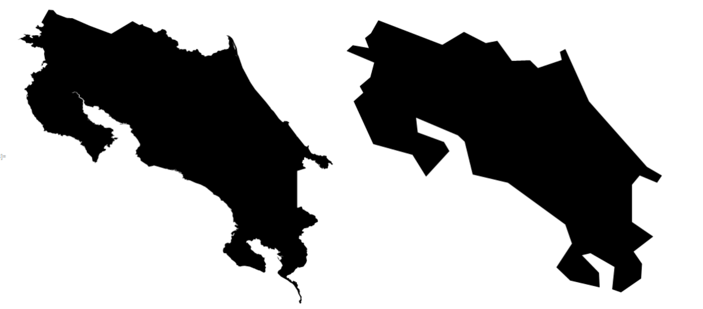

## Step Three: Define an interior

I would like to make a raised lip around the outside of the keychain, so I will use some code I wrote last year that creates a boundary of a fixed thickness on the inside or outside of a given polygon.

Before I apply it, I'll remove some of the peninsulas from our polygon and some of the redundant vertices and visualize the difference:

```{.mathematica}
minimal = { { -85.6144,  11.2142}, { -84.9387,  
   10.9541}, { -84.7104,  11.091}, { -84.4801,  10.973}, { -84.3577,  
   10.9965}, { -84.2041,  10.7839}, { -84.0131,  
   10.7908}, { -83.9293,  10.7087}, { -83.5979,  
   10.8238}, { -83.3902,  10.3557}, { -82.7786,  
   9.66272}, { -82.9361,  9.47312}, { -82.9359,  
   9.07847}, { -82.9192,  8.76513}, { -83.1207,  
   8.60242}, { -83.3745,  8.74827}, { -83.5704,  
   8.84997}, { -83.6403,  9.05175}, { -84.2461,  
   9.49397}, { -84.6181,  9.58172}, { -84.703,  9.92881}, { -84.774,  
   9.99558}, { -85.2166,  10.1833}, { -85.1987,  
   10.0272}, { -85.2539,  9.78983}, { -85.6684,  
   9.90357}, { -85.8752,  10.3566}, { -85.7732,  
   10.4469}, { -85.811,  10.5156}, { -85.6584,  10.766}, { -85.7141,  
   10.9201}}; 

Graphics[{Polygon@simplified, Gray, Polygon@minimal]}]
```

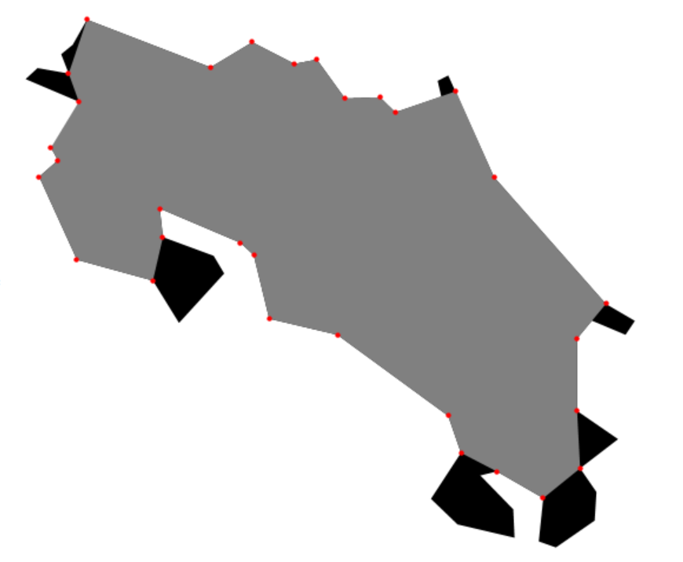

Now let's describe the algorithm to create a polygon nested inside our bounding shape—we'll be using geometry and trigonometry!  We define the vertices of the interior polygon in relation to the vertices of the exterior polygon.  The interior vertex is found along the angle bisector of the edges incident with the exterior vertex. We determine its final position by ensuring that the distance to each exterior edge is the prescribed distance `ep`.

Let me give you the code and then dissect it.

```{.mathematica}
ep = .15;
boundarypoints = Reverse@minimal;

interiorhalfangles = 
  Table[FullSimplify[
   Mod[
    Apply[ArcTan, 
              (boundarypoints[[i]] - 
               boundarypoints[[Mod[i + 1, Length[boundarypoints], 1]]])
              ] - 
         Apply[ArcTan, 
             (boundarypoints[[Mod[i + 2, Length[boundarypoints], 1]]] - 
                boundarypoints[[Mod[i + 1, Length[boundarypoints], 1]]])
              ], 
         2 Pi]],
     {i, Length[boundarypoints]}]/2;

edgedirections = 

   Table[FullSimplify[
      Apply[ArcTan, 
        boundarypoints[[Mod[i + 2, Length[boundarypoints], 1]]] - 
         boundarypoints[[Mod[i + 1, Length[boundarypoints], 1]]]]], 
     {i, Length[boundarypoints]}];

interiorvectors = 
   Map[AngleVector, interiorhalfangles + edgedirections];

interiorvertices = 
  MapThread[#1 + ep/Sin[#3] #2 &, 
      {RotateLeft[boundarypoints], interiorvectors, interiorhalfangles}]
```

We choose our thickness (`ep` for epsilon) to be .15.  Notice that the following command is to invert the order of the points on the bounding polygon.  If we had left the list as is, the new polygon would have been constructed on the outside of the original polygon instead of on the inside.

Then I find the interior half angles by using a special overloading of the `ArcTan` command.  The expected functionality of `ArcTan` is that `ArcTan` applied to a single number finds the angle whose tangent is that number.  More useful in this context is the two argument version of `ArcTan`:

**Useful Command:** `ArcTan[x,y]` gives the angle that the line through (x,y) makes with the positive x-axis.

I have used `ArcTan` to find the angles that each of the directed edges make with the positive x-axis and taking their difference modulo 2π so that the number is between 0 and 2π.  Another command that seemed useful when I started programming was `VectorAngle`, which finds the angle between two vectors, but that gives the unsigned angle instead of the signed angle between the two vectors.

If we add the interior half angle to the angle that the corresponding edge makes with the x-axis, we get the direction of the vector leaving the exterior vertex toward the interior vertex.  Applying the command `AngleVector` gives the unit vector in that direction. (It gives me warm fuzzy feelings to know that Mathematica has both a command `VectorAngle` and a command `AngleVector`!)

The interior vertices are finally calculated using trigonometry to calculate the distance along this unit vector from the exterior vertex.

The final result is a polygon that nests perfectly inside the original Costa Rica shape.

```{.mathematica}
Graphics[{Polygon@simplified, Red, Polygon@interiorvertices}]
```

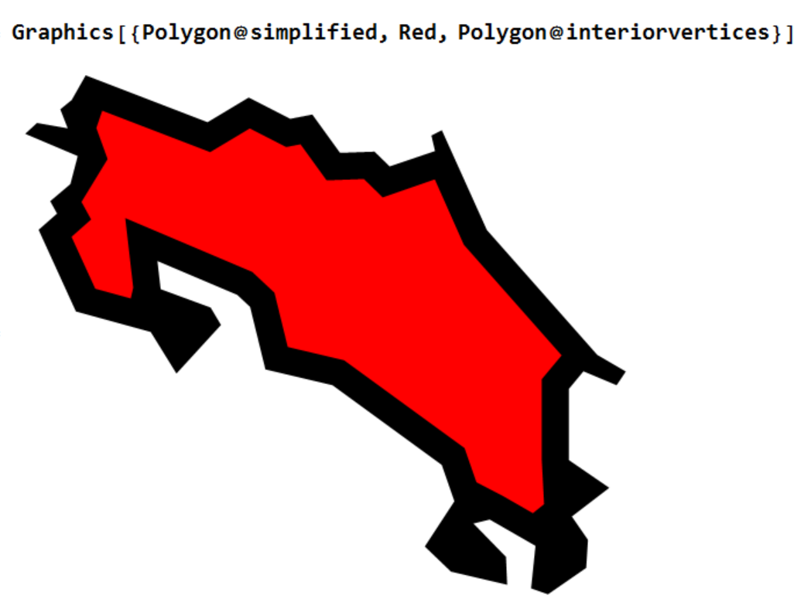

## Step Four: Create a Mesh Object

Now that we have our exterior polygon and our interior polygon, we will convert these Graphics objects into `MeshRegion` objects, since this seems to be the underlying structure necessary to export three dimensional objects to STL files.  The first step is to use `DiscretizeGraphics` to convert the polygons into `MeshRegion` objects.

```{.mathematica}
interior = DiscretizeGraphics@Graphics@Polygon@interiorvertices
exterior = DiscretizeGraphics@Graphics@Polygon@simplified
```

Then we use `RegionDifference` to excise the interior from the exterior.

```{.mathematica}
lip = RegionDifference[exterior, interior]
```

The last pieces we need are the boundaries of these regions.

```{.mathematica}
exteriorbdry = RegionBoundary@exterior
interiorbdry = RegionBoundary@interior
```

With these building blocks, we can create our three-dimensional model.  We define four variables that are the heights of each of the layers, making sure that they are numerical / decimal instead of exact / infinitely precise numbers.  There are errors if you use exact numbers like '`0`' instead of '`0.`'.  I am not sure why.

**Pro tip:** Notice that I have defined these variables outside the subsequent code.  By separating the definition of the variables, it makes it easier to modify the rest of the code later if you need to change a parameter for aesthetic or printing reasons.

```{.mathematica}
extbottom = 0.;
intbottom = 0.1;
inttop = 0.2;
exttop = 0.3;
```

And then build the pieces that comprise the hull of the model by using a `RegionProduct` command.

```{.mathematica}
Show[
  RegionProduct[interior, Point[{{intbottom}}]],
  RegionProduct[interior, Point[{{inttop}}]],
  RegionProduct[interiorbdry, Line[{{extbottom}, {intbottom}}]],
  RegionProduct[interiorbdry, Line[{{inttop}, {exttop}}]],
  RegionProduct[lip, Point[{{extbottom}}]],
  RegionProduct[lip, Point[{{exttop}}]],
  RegionProduct[RegionBoundary@exteriorbdry, 
                 Line[{{extbottom}, {exttop}}]]]
```

You can see each of these objects individually and all assembled together.

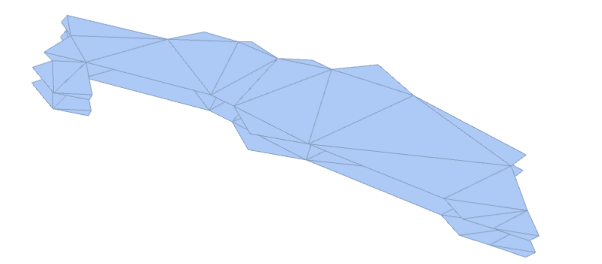

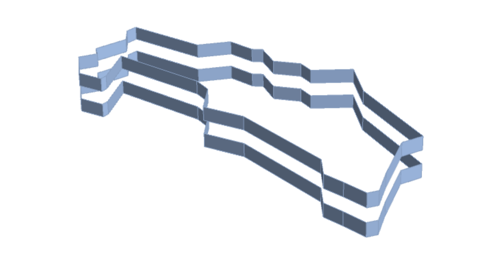

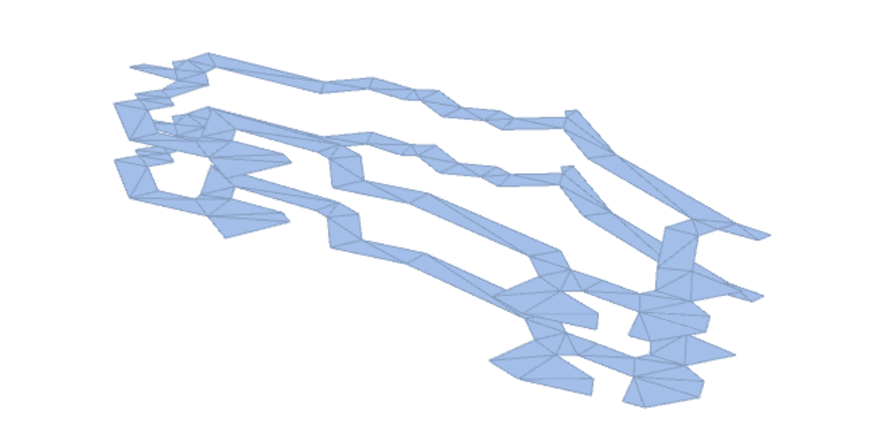

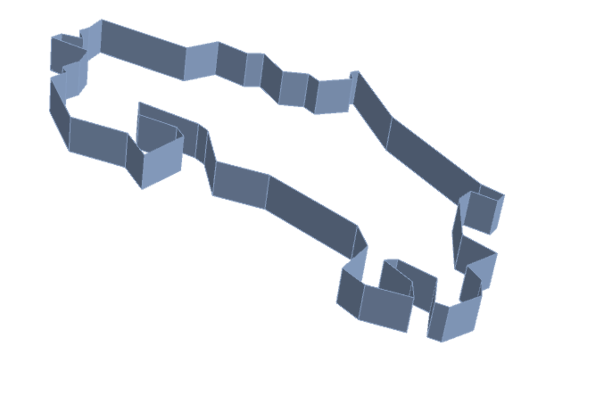

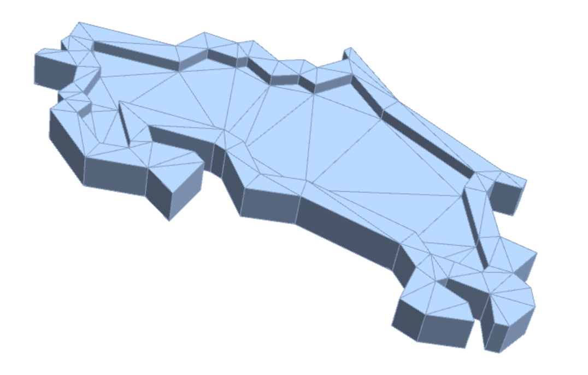

## Step Five: Add a loop

Since we want to use this object as a keychain, we need to add in a ring onto which we can clip a key ring.  To do this we will be adding a torus into the object, which has this general form.

```{.mathematica}
thickness = .15;
innerradius = .8;
outerradius = 2;
xcoord = -84;
ycoord = 10.75;
zcoord = Mean[{extbottom, exttop}];
loop = ParametricPlot3D[{
    (outerradius thickness + innerradius thickness Cos[v]) Cos[u] +
     xcoord, 
    (outerradius thickness + innerradius thickness Cos[v]) Sin[u] +
     ycoord + 2 thickness, 
     thickness Sin[v] + zcoord},
    {u, 0, 2 Pi}, {v, 0, 2 Pi}, Mesh -> None, PlotPoints -> 200];
```

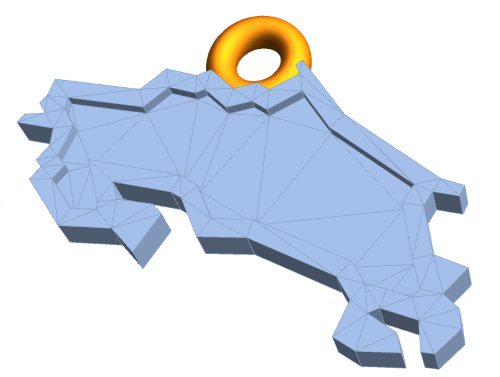

I chose the ring to have the same thickness as the body and played with the other parameters, especially the x-, y-, and z-translations to figure out where best on the model to place it.  One reason why I think my choices work well is because the circle is basically just North of the center of gravity—the map of Costa Rica will have North oriented upward when dangling from the keychain!

## Step Six: Send to the printer!

Now let's print out the model!  (Remember that there is more detail on the prototyping and printing processes at the bottom of the [name ring design post](../2017-03-01-3d-design-in-mathematica-creating-a-name-ring/index.qmd).)  One thing we have to take into consideration is that stainless steel requires a 1 mm thickness everywhere, which may mean that you will have to change the thickness parameters above if you want to shrink the keychain much smaller.  Here is what Shapeways gives as a 3D rendering of the keychain

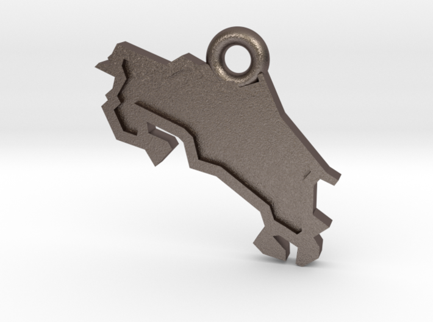

And here is a 3D rendering of the keychain by Sketchfab

<iframe allowfullscreen="" allowvr="" frameborder="0" height="300" mozallowfullscreen="true" onmousewheel="" src="https://sketchfab.com/models/14e98b2e1ac4492097d23b650acc859f/embed" webkitallowfullscreen="true" width="420"></iframe>

Now you have the tools to make your own keychain for any country or administrative region. What countries are on your ~~bucket~~ keychain list?  Until next time!

:::: {style="font-size: 110%; text-align: center;"}

Christopher Hanusa's portfolio is available online at

[](http://hanusadesign.com)

Purchase a copy of this and other 3D printed artwork

at [Hanusa ≀ Design on Shapeways](https://www.shapeways.com/shops/mathartshop).

::::
