Today we continue our series in 3D Design in Mathematica.  I'll teach you how to use the `RegionPlot3D` command to create custom dice.  Let's first start off with a story I teach in my combinatorics class.  Most people are familiar with a cubical die having six sides labeled with pips representing the numbers 1 through 6, each of which has the same probability of coming up when the die is rolled.

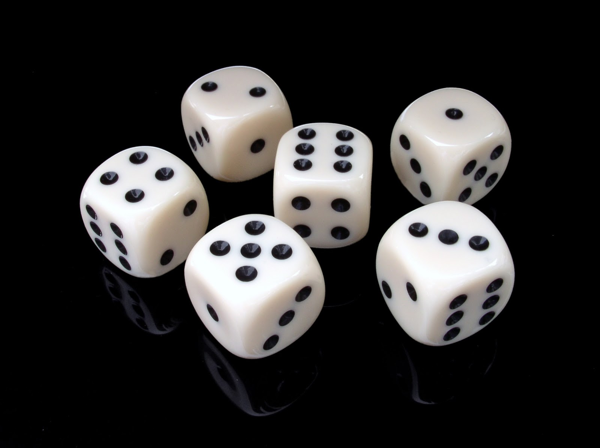

What happens when two dice are rolled and we consider their sum?  The possible values are between 2 and 12 with a predictable distribution.

<table align="center">
<tr align="center">
<td width=20px></td>
<td width=20px><b>1</b></td>
<td width=20px><b>2</b></td>
<td width=20px><b>3</b></td>
<td width=20px><b>4</b></td>
<td width=20px><b>5</b></td>
<td width=20px><b>6</b></td>
</tr>
<tr align="center">
<td><b>1</b></td>
<td bgcolor="#fcf">2</td>
<td bgcolor="#f99">3</td>
<td bgcolor="#fc0">4</td>
<td bgcolor="#ff6">5</td>
<td bgcolor="#cf6">6</td>
<td bgcolor="#9f9">7</td>
</tr>
<tr align="center">
<td><b>2</b></td>
<td bgcolor="#f99">3</td>
<td bgcolor="#fc0">4</td>
<td bgcolor="#ff6">5</td>
<td bgcolor="#cf6">6</td>
<td bgcolor="#9f9">7</td>
<td bgcolor="#6fc">8</td>
</tr>
<tr align="center">
<td><b>3</b></td>
<td bgcolor="#fc0">4</td>
<td bgcolor="#ff6">5</td>
<td bgcolor="#cf6">6</td>
<td bgcolor="#9f9">7</td>
<td bgcolor="#6fc">8</td>
<td bgcolor="#6cc">9</td>
</tr>
<tr align="center">
<td><b>4</b></td>
<td bgcolor="#ff6">5</td>
<td bgcolor="#cf6">6</td>
<td bgcolor="#9f9">7</td>
<td bgcolor="#6fc">8</td>
<td bgcolor="#6cc">9</td>
<td bgcolor="#99f">10</td>
</tr>
<tr align="center">
<td><b>5</b></td>
<td bgcolor="#cf6">6</td>
<td bgcolor="#9f9">7</td>
<td bgcolor="#6fc">8</td>
<td bgcolor="#6cc">9</td>
<td bgcolor="#99f">10</td>
<td bgcolor="#66c">11</td>
</tr>
<tr align="center">
<td><b>6</b></td>
<td bgcolor="#9f9">7</td>
<td bgcolor="#6fc">8</td>
<td bgcolor="#6cc">9</td>
<td bgcolor="#99f">10</td>
<td bgcolor="#66c">11</td>
<td bgcolor="#93f">12</td>
</tr>
</table>

**Question of the day:** Are there two other dice (not labeled 1 through 6) that when rolled and summed have the same chance of giving the sums in this table?

**Answer of the day:** Yes!  Consider the pair of [Sicherman dice](https://en.wikipedia.org/wiki/Sicherman_dice).  The first die has sides 1, 2, 2, 3, 3, and 4, while the second die has sides 1, 3, 4, 5, 6, and 8.  Here is the distribution of sums of these two dice.

<table align="center">
<tr align="center">
<td width=20px></td>
<td width=20px><b>1</b></td>
<td width=20px><b>2</b></td>
<td width=20px><b>2</b></td>
<td width=20px><b>3</b></td>
<td width=20px><b>3</b></td>
<td width=20px><b>4</b></td>
</tr>
<tr align="center">
<td><b>1</b></td>
<td bgcolor="#fcf">2</td>
<td bgcolor="#f99">3</td>
<td bgcolor="#f99">3</td>
<td bgcolor="#fc0">4</td>
<td bgcolor="#fc0">4</td>
<td bgcolor="#ff6">5</td>
</tr>
<tr align="center">
<td><b>3</b></td>
<td bgcolor="#fc0">4</td>
<td bgcolor="#ff6">5</td>
<td bgcolor="#ff6">5</td>
<td bgcolor="#cf6">6</td>
<td bgcolor="#cf6">6</td>
<td bgcolor="#9f9">7</td>
</tr>
<tr align="center">
<td><b>4</b></td>
<td bgcolor="#ff6">5</td>
<td bgcolor="#cf6">6</td>
<td bgcolor="#cf6">6</td>
<td bgcolor="#9f9">7</td>
<td bgcolor="#9f9">7</td>
<td bgcolor="#6fc">8</td>
</tr>
<tr align="center">
<td><b>5</b></td>
<td bgcolor="#cf6">6</td>
<td bgcolor="#9f9">7</td>
<td bgcolor="#9f9">7</td>
<td bgcolor="#6fc">8</td>
<td bgcolor="#6fc">8</td>
<td bgcolor="#6cc">9</td>
</tr>
<tr align="center">
<td><b>6</b></td>
<td bgcolor="#9f9">7</td>
<td bgcolor="#6fc">8</td>
<td bgcolor="#6fc">8</td>
<td bgcolor="#6cc">9</td>
<td bgcolor="#6cc">9</td>
<td bgcolor="#99f">10</td>
</tr>
<tr align="center">
<td><b>8</b></td>
<td bgcolor="#6cc">9</td>
<td bgcolor="#99f">10</td>
<td bgcolor="#99f">10</td>
<td bgcolor="#66c">11</td>
<td bgcolor="#66c">11</td>
<td bgcolor="#93f">12</td>
</tr>
</table>

You can count how many times each number appears to verify that the number of appearances of 2, 3, ... 12 are the same for each pair of dice.  Let's modify these dice even further by subtracting one from each number on the first die (0, 1, 1, 2, 2, 3) and adding one to each number on the second die (2, 4, 5, 6, 7, 9), which doesn't change any sum one bit!

<table align="center">
<tr align="center">
<td width=20px></td>
<td width=20px><b>0</b></td>
<td width=20px><b>1</b></td>
<td width=20px><b>1</b></td>
<td width=20px><b>2</b></td>
<td width=20px><b>2</b></td>
<td width=20px><b>3</b></td>
</tr>
<tr align="center">
<td><b>2</b></td>
<td bgcolor="#fcf">2</td>
<td bgcolor="#f99">3</td>
<td bgcolor="#f99">3</td>
<td bgcolor="#fc0">4</td>
<td bgcolor="#fc0">4</td>
<td bgcolor="#ff6">5</td>
</tr>
<tr align="center">
<td><b>4</b></td>
<td bgcolor="#fc0">4</td>
<td bgcolor="#ff6">5</td>
<td bgcolor="#ff6">5</td>
<td bgcolor="#cf6">6</td>
<td bgcolor="#cf6">6</td>
<td bgcolor="#9f9">7</td>
</tr>
<tr align="center">
<td><b>5</b></td>
<td bgcolor="#ff6">5</td>
<td bgcolor="#cf6">6</td>
<td bgcolor="#cf6">6</td>
<td bgcolor="#9f9">7</td>
<td bgcolor="#9f9">7</td>
<td bgcolor="#6fc">8</td>
</tr>
<tr align="center">
<td><b>6</b></td>
<td bgcolor="#cf6">6</td>
<td bgcolor="#9f9">7</td>
<td bgcolor="#9f9">7</td>
<td bgcolor="#6fc">8</td>
<td bgcolor="#6fc">8</td>
<td bgcolor="#6cc">9</td>
</tr>
<tr align="center">
<td><b>7</b></td>
<td bgcolor="#9f9">7</td>
<td bgcolor="#6fc">8</td>
<td bgcolor="#6fc">8</td>
<td bgcolor="#6cc">9</td>
<td bgcolor="#6cc">9</td>
<td bgcolor="#99f">10</td>
</tr>
<tr align="center">
<td><b>9</b></td>
<td bgcolor="#6cc">9</td>
<td bgcolor="#99f">10</td>
<td bgcolor="#99f">10</td>
<td bgcolor="#66c">11</td>
<td bgcolor="#66c">11</td>
<td bgcolor="#93f">12</td>
</tr>
</table>

This example is a great application of [generating functions](https://en.wikipedia.org/wiki/Generating_function), because the existence of these dice is a direct result of the polynomial identity:

\[(x^1+x^2+x^3+x^4+x^5+x^6)^2=(x^0+2x^1+2x^2+x^3)(x^2+x^4+x^5+x^6+x^7+x^9).\]

Since these modified Sicherman dice are not easy to find at your local store (or at ANY store), we'll design our own copies as our task for today.  If you're interested in dice, I suggest checking out [The Dice Lab](http://thedicelab.com/) by Henry Segerman and Robert Fathauer where they've taken a mathematician's view toward perfecting dice.

Also, if you've missed an installment in the series, you can learn about designing a [name ring](http://blog.mathzorro.com/2017/03/Creating-a-Name-Ring.html), a [geometric terrarium](http://blog.mathzorro.com/2017/04/polyhedral-terrarium.html), or a [country keychain](http://blog.mathzorro.com/2017/05/costa-rica-keychain.html).

Now on to the tutorial!

## Step One: Determine a plan for the dice

One of the things about standard dice that I consider crucial is that the opposite sides of each die add to the same number.  The 1 is opposite the 6, the 2 is opposite the 5, and the 3 is opposite the four.  If we were to build a die out of paper and unfold the sides, we would get the following two-dimensional visualization:

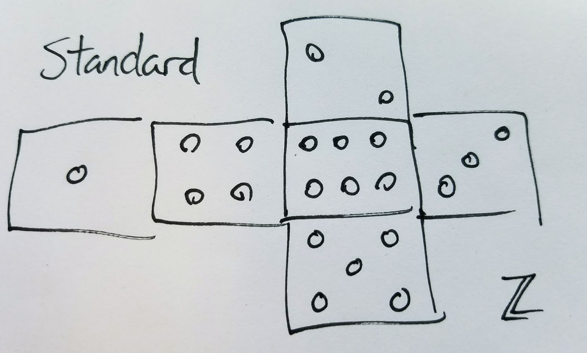

We need to now place the numbers 0, 1, 1, 2, 2, 3 on the first die; I'll choose to continue the convention by ensuring that the 0 is opposite the 3 and each 1 is opposite a 2.  (If you prefer to place the 1s opposite each other and the 2s opposite each other, you can modify our code to make your own dice!)  I also plan to organize it so that the diagonals formed by the pips of the 2s are oriented in the same way.

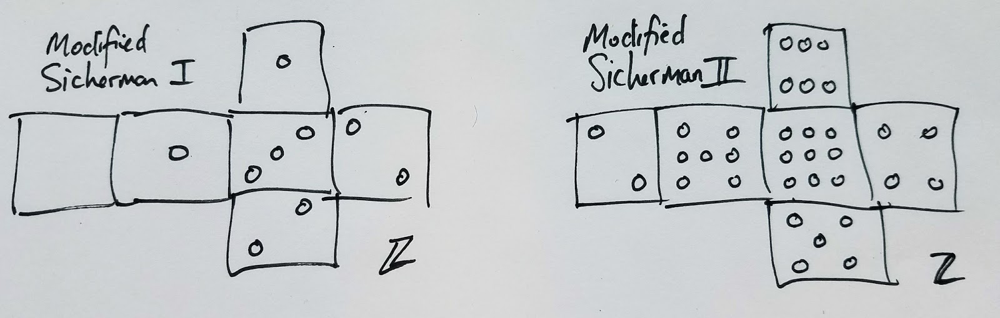

The decisions in placing the numbers 2, 4, 5, 6, 7, 9 on the second die include the slant of the pips on the two and the orientation of the pips on the 6 and the 7.  I think I'll just wing it and if my work turns out differently from my sketch then so be it!

## Step Two: Understand how `RegionPlot3D` works

Today we'll be using Mathematica's `RegionPlot3D` command, which is one of the few ways in which Mathematica allows you to intersect three-dimensional regions.  (Disappointingly, you can't intersect 3D `MeshRegion` objects like we used last time!)

`RegionPlot3D` outputs the three-dimensional object defined by a set of restrictions you specify along with boolean operators that indicate how your restrictions interact.

For instance, if you want to find the intersection of two spheres, you want points that are in both the first sphere AND the second sphere, so you would use the AND operator `&&` like this:

```{.mathematica}
RegionPlot3D[ x^2+y^2+z^2 <= 1 && (x-1)^2+y^2+z^2 <= 1, 
 {x, 0, 1}, {y, -1, 1}, {z, -1, 1}]
```

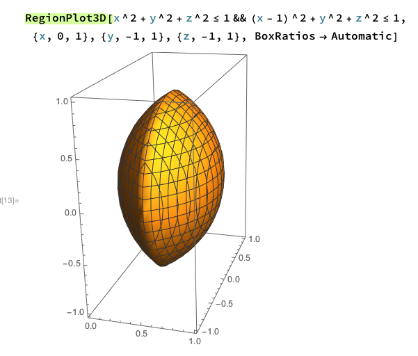

If on the other hand you would like to find the union of two spheres, you want points that are in either the first sphere OR the second sphere, so you would use the OR operator `||` like this:

```{.mathematica}
RegionPlot3D[ x^2+y^2+z^2 <= 1 || (x-1)^2+y^2+z^2 <= 1, 
 {x, -1, 2}, {y, -1.5, 1.5}, {z, -1.5, 1.5}]
```

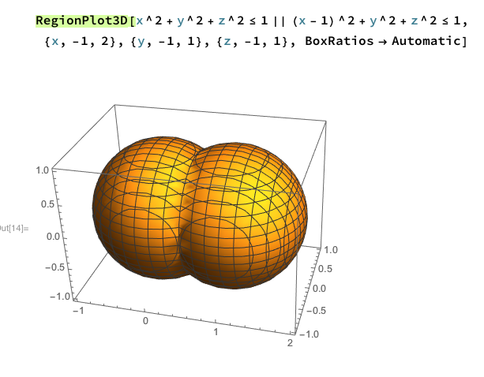

You must specify the bounds on the $x$, $y$, and $z$ variables where Mathematica will be looking for the valid points.

When we are making our dice, we will start with a basic cube, defined by points where the $x$, $y$, and $z$ values are between $-1$ and $1$:

```{.mathematica}
RegionPlot3D[Abs[x] <= 1 && Abs[y] <= 1 && Abs[z] <= 1, {x, -1.1, 1.1}, {y, -1.1, 1.1}, {z, -1.1, 1.1}]
```

so that the equations of the sides of the cube are $x=1$, $x=-1$, $y=1$, $y=-1$, $z=1$, $z=-1$.

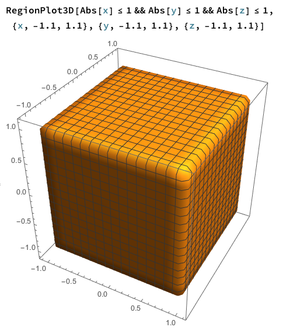

Now suppose we want to create the pips of the dice.  I will do so by removing spheres from each of the faces.  For instance, if we want to create one pip on the $z=1$ face, which would be centered at coordinates $(0,0,1)$, we will want the points that are in the cube with the points AND outside the sphere

\[x^2+y^2+(z-1)^2=r^2,\]

which we do with the code

```{.mathematica}
pip = .04;

RegionPlot3D[
   Abs[x] <= 1 && Abs[y] <= 1 && Abs[z] <= 1 &&
     (x^2 + y^2 + (z - 1)^2 >= pip)
     , {x, -1.1, 1.1}, {y, -1.1, 1.1}, {z, -1.1, 1.1},
     PlotStyle -> White, Mesh -> None, Axes -> False, Boxed -> False]
```

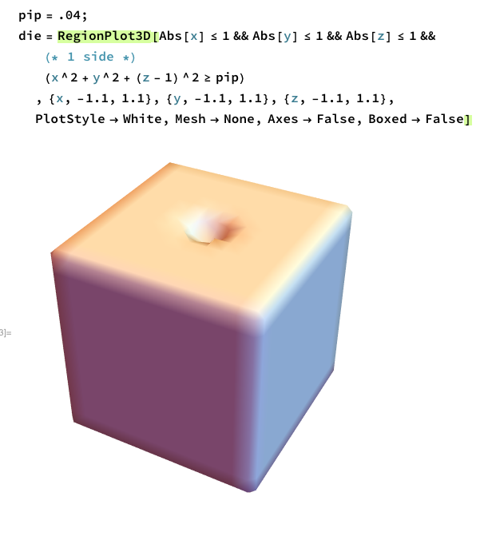

We have chosen $r=.2$, so $r^2=.04$.  Note that we have changed the color using `PlotStyle -> White`, removed the lines from the surface with the option `Mesh -> None`, and removed the bounding wire cube and tickmarks using `Axes -> False` and `Boxed -> False`.

One of the issues with `RegionPlot3D` is the resolution of the file you create.  In order to have a better approximation of the three-dimensional object that is determined by the inequalities you provide, you can use the `PlotPoints` option, which tells how much sampling you want Mathematica to do in the range you specify.  Here you can see the difference in the result when you specify `PlotPoints -> 10`, `PlotPoints -> 50`, `PlotPoints -> 100`, and `PlotPoints -> 200`:

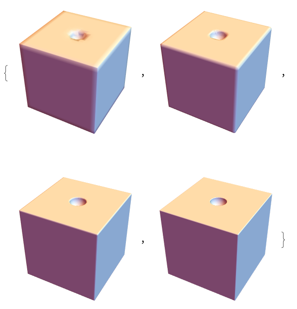

During the testing phase I used `PlotPoints -> 50`, but when creating the final STL file I specified `PlotPoints -> 250` which took quite a while to compute.

## Step Three: Rounding the Edges

We'll get back to the pips in a little bit, but first let's perfect the cube.  You'll notice that when `PlotPoints -> 200` is specified, the die starts to look more and more like a perfect cube.  If you look at a normal die, you'll see that it is not a perfect cube—the edges are rounded.  What sort of inequality restriction works to make a rounded edge?  We need some sort of cylindrical constraint like
\[(x-h)^2+(y-k)^2 < r^2.\]
To line up with the faces of the cube, we need the radius of the cylinder to be the same as the distance from the point (h,k) to both faces.  So in the simplest case we need something that looks like

\[(x - .8)^2 + (y - .8)^2 < .2^2\]

since it says that the distance to the $x=1$ face and to the $y=1$ face equals the radius $0.2$.  (I tried a couple different radii and this one looked the best to my eyes.)

But simply including this cylindrical restriction would only include the part of the cube that is in the cylinder, which defeats the purpose.

```{.mathematica}
RegionPlot[((x - .8)^2 + (y - .8)^2 < .2^2), {x, 0, 1.1}, {y, 0, 1.1}]
```

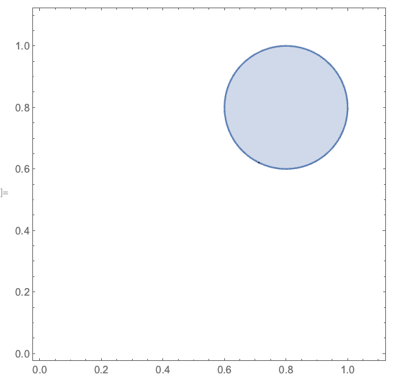

We need to instead merge this with two additional restrictions that either you are in the cylinder OR you satisfy $x<.8$ OR you satisfy $y<.8$.  By doing this, the restriction on our cube is exactly the rounded bezel we wanted, as you can see here.

```{.mathematica}
RegionPlot[((x-.8)^2+(y-.8)^2<.2^2||x<=.8||y<=.8)
  {x, 0, 1.1}, {y, 0, 1.1}]
```

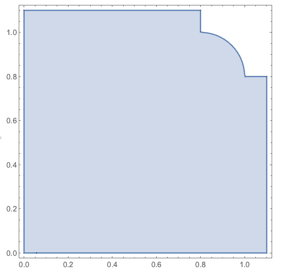

We'll have to include this restriction for all twelve edges of the cube, which is coded as follows:

```{.mathematica}
RegionPlot3D[Abs[x]<=1&&Abs[y]<=1&&Abs[z]<=1&&
 ((x-.8)^2+(y-.8)^2<.2^2||x<=.8||y<=.8)&&
 ((x-.8)^2+(y+.8)^2<.2^2||x<=.8||y>=-.8)&&
 ((x+.8)^2+(y-.8)^2<.2^2||x>=-.8||y<=.8)&&
 ((x+.8)^2+(y+.8)^2<.2^2||x>=-.8||y>=-.8)&&
 ((x-.8)^2+(z-.8)^2<.2^2||x<=.8||z<=.8)&&
 ((x-.8)^2+(z+.8)^2<.2^2||x<=.8||z>=-.8)&&
 ((x+.8)^2+(z-.8)^2<.2^2||x>=-.8||z<=.8)&&
 ((x+.8)^2+(z+.8)^2<.2^2||x>=-.8||z>=-.8)&&
 ((y-.8)^2+(z-.8)^2<.2^2||y<=.8||z<=.8)&&
 ((y-.8)^2+(z+.8)^2<.2^2||y<=.8||z>=-.8)&&
 ((y+.8)^2+(z-.8)^2<.2^2||y>=-.8||z<=.8)&&
 ((y+.8)^2+(z+.8)^2<.2^2||y>=-.8||z>=-.8)&&
 (x^2+y^2+(z-1)^2>=pip)
 ,{x,-1.1,1.1},{y,-1.1,1.1},{z,-1.1,1.1},
 PlotPoints->100,PlotStyle->White,Mesh->None,Axes->False,Boxed->False]
```

and looks like this:

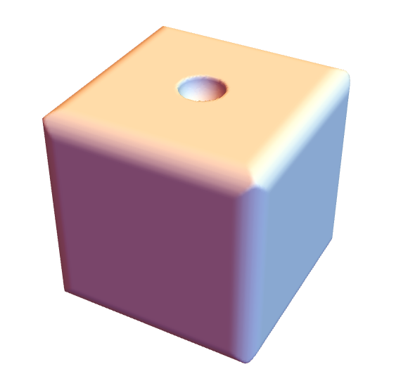

Note that we could have used a similar method to round the corners, but I preferred this styling.

## Step Four: Lay out the pips

Now onto the task of placing the pips.  Let's start with my Modified Sicherman Die I with sides (0,1,1,2,2,3), which will be easier for us to code.  We'll put the one-pip sides on the $x=-1$ and $y=1$ faces, the two-pip sides on the $x=1$ and $y=-1$ faces, and the three-pip side on the $z=-1$ face.  Here is the Mathematica code for this:

```{.mathematica}
(* 1 side *)
  ((x + 1)^2 + y^2 + z^2 >= pip) &&
 
(* 1 side *)
  (x^2 + (y - 1)^2 + z^2 >= pip) &&
 
(* 2 side *)
  ((x - 1)^2 + (y + .5)^2 + (z + .5)^2 >= pip) &&
  ((x - 1)^2 + (y - .5)^2 + (z - .5)^2 >= pip) &&
 
(* 2 side *)
  ((x + .5)^2 + (y + 1)^2 + (z + .5)^2 >= pip) &&
  ((x - .5)^2 + (y + 1)^2 + (z - .5)^2 >= pip)
 
(* 3 side *)
  ( (x + .5)^2 + (y + .5)^2 + (z + 1)^2 >= pip) &&
  ( x^2 + y^2 + (z + 1)^2 >= pip) &&
  ( (x - .5)^2 + (y - .5)^2 + (z + 1)^2 >= pip) &&
```

As you can see, the three-pip side has three spheres, centered at $(-.5,-.5,-1)$, $(0,0,-1)$, and $(.5,.5,-1)$, all indeed lying on the face $z=-1$.

For my Modified Sicherman Die II with sides (2,4,5,6,7,9), we place the two- and nine-pip sides on the $z$ faces, the five- and six-pip sides on the $x$ faces, and the four- and seven-pip sides on the $y$ faces:

```{.mathematica}
(* 2 side *)
  ((x + .5)^2 + (y + .5)^2 + (z - 1)^2 >= pip) &&
  ((x - .5)^2 + (y - .5)^2 + (z - 1)^2 >= pip) &&
  
(* 9 side *)
  ((x + .5)^2 + (y + .5)^2 + (z + 1)^2 >= pip) &&
  ((x + .5)^2 + y^2 + (z + 1)^2 >= pip) &&
  ((x + .5)^2 + (y - .5)^2 + (z + 1)^2 >= pip) &&
  (x^2 + (y + .5)^2 + (z + 1)^2 >= pip) &&
  (x^2 + y^2 + (z + 1)^2 >= pip) &&
  (x^2 + (y - .5)^2 + (z + 1)^2 >= pip) &&
  ((x - .5)^2 + (y + .5)^2 + (z + 1)^2 >= pip) &&
  ((x - .5)^2 + y^2 + (z + 1)^2 >=  pip) &&
  ((x - .5)^2 + (y - .5)^2 + (z + 1)^2 >= pip) &&
  
(* 6 side *)
  ((x - 1)^2 + (y + .5)^2 + (z + .5)^2 >= pip) &&
  ((x - 1)^2 + (y)^2 + (z + .5)^2 >= pip) &&
  ((x - 1)^2 + (y - .5)^2 + (z - .5)^2 >= pip) &&
  ((x - 1)^2 + (y + .5)^2 + (z - .5)^2 >= pip) &&
  ((x - 1)^2 + (y)^2 + (z - .5)^2 >= pip) &&
  ((x - 1)^2 + (y - .5)^2 + (z + .5)^2 >= pip) &&
  
(* 5 side *)
  ((x + 1)^2 + y^2 + z^2 >= pip) &&
  ((x + 1)^2 + (y + .5)^2 + (z + .5)^2 >= pip) &&
  ((x + 1)^2 + (y + .5)^2 + (z - .5)^2 >= pip) &&
  ((x + 1)^2 + (y - .5)^2 + (z + .5)^2 >= pip) &&
  ((x + 1)^2 + (y - .5)^2 + (z - .5)^2 >= pip) &&
  
(* 4 side *)
  ((x + .5)^2 + (y - 1)^2 + (z + .5)^2 >= pip) &&
  ((x + .5)^2 + (y - 1)^2 + (z - .5)^2 >= pip) &&
  ((x - .5)^2 + (y - 1)^2 + (z + .5)^2 >= pip) &&
  ((x - .5)^2 + (y - 1)^2 + (z - .5)^2 >= pip) &&
  
(* 7 side *)
  ((x + .5)^2 + (y + 1)^2 + (z + .5)^2 >= pip) &&
  ((x)^2 + (y + 1)^2 + (z - .5)^2 >= pip) &&
  ((x + .5)^2 + (y + 1)^2 + (z - .5)^2 >= pip) &&
  ((x)^2 + (y + 1)^2 + (z)^2 >= pip) &&
  ((x - .5)^2 + (y + 1)^2 + (z + .5)^2 >= pip) &&
  ((x)^2 + (y + 1)^2 + (z + .5)^2 >= pip) &&
  ((x - .5)^2 + (y + 1)^2 + (z - .5)^2 >= pip)
```

All these spheres were placed by hand with coordinates in the set $\{-1,-.5,0,.5,1)$.  Here's a fun picture of what it looks likes when all the pips' spheres are *added* to the cube!

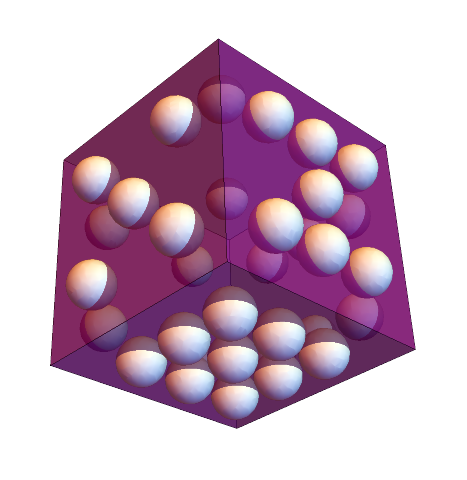

## Step Five: Get them printed!

To serve as a recap, here is the entirety of the code that generates my Modified Sicherman Die I.

```{.mathematica}
pip = .04;
die = RegionPlot3D[
   Abs[x] <= 1 && Abs[y] <= 1 && Abs[z] <= 1 &&
  ((x-.8)^2+(y-.8)^2<.2^2||x<=.8||y<=.8)&&
  ((x-.8)^2+(y+.8)^2<.2^2||x<=.8||y>=-.8)&&
  ((x+.8)^2+(y-.8)^2<.2^2||x>=-.8||y<=.8)&&
  ((x+.8)^2+(y+.8)^2<.2^2||x>=-.8||y>=-.8)&&
  ((x-.8)^2+(z-.8)^2<.2^2||x<=.8||z<=.8)&&
  ((x-.8)^2+(z+.8)^2<.2^2||x<=.8||z>=-.8)&&
  ((x+.8)^2+(z-.8)^2<.2^2||x>=-.8||z<=.8)&&
  ((x+.8)^2+(z+.8)^2<.2^2||x>=-.8||z>=-.8)&&
  ((y-.8)^2+(z-.8)^2<.2^2||y<=.8||z<=.8)&&
  ((y-.8)^2+(z+.8)^2<.2^2||y<=.8||z>=-.8)&&
  ((y+.8)^2+(z-.8)^2<.2^2||y>=-.8||z<=.8)&&
  ((y+.8)^2+(z+.8)^2<.2^2||y>=-.8||z>=-.8)&&
  ((x + 1)^2 + y^2 + z^2 >= pip) &&
  (x^2 + (y - 1)^2 + z^2 >= pip) &&
  ((x - 1)^2 + (y + .5)^2 + (z + .5)^2 >= pip) &&
  ((x - 1)^2 + (y - .5)^2 + (z - .5)^2 >= pip) &&
  ((x + .5)^2 + (y + 1)^2 + (z + .5)^2 >= pip) &&
  ((x - .5)^2 + (y + 1)^2 + (z - .5)^2 >= pip)
  ( (x + .5)^2 + (y + .5)^2 + (z + 1)^2 >= pip) &&
  ( x^2 + y^2 + (z + 1)^2 >= pip) &&
  ( (x - .5)^2 + (y - .5)^2 + (z + 1)^2 >= pip) &&
  , {x, -1.1, 1.1}, {y, -1.1, 1.1}, {z, -1.1, 1.1}, PlotPoints -> 250,
   PlotStyle -> White, Mesh -> None, Axes -> False, Boxed -> False]
```

After exporting the STL files for my two dice (using `PlotPoints -> 250`), here is a rendering of the final version of my modified Sicherman dice on Sketchfab:

<iframe allowfullscreen="" allowvr="" frameborder="0" height="300" mozallowfullscreen="true" onmousewheel="" src="https://sketchfab.com/models/e9390679179348ab9ba4093e9a15c6fa/embed" webkitallowfullscreen="true" width="420"></iframe>

I printed them on the local Lulzbot Mini 3D printers that the Queens College Art department has so graciously loaned us.  They look good too!

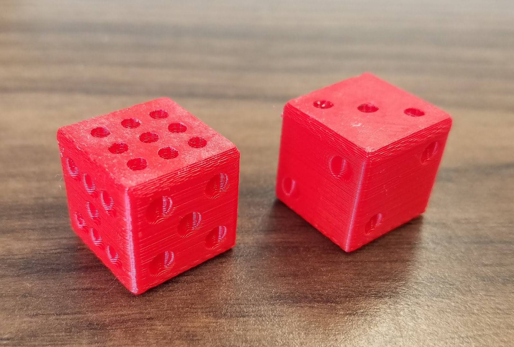

You can buy your own pair of [modified Sicherman dice on Shapeways](http://shpws.me/Ozmd) or print your own copy of the [STL files](https://www.thingiverse.com/thing:2337535) I posted on Thingiverse. I don't guarantee that my modified Sicherman dice are unbiased because by removing material from the sides of the dice they no longer symmetrical.

The same technique above shows that a 4-sided die with sides (1,4,4,7) and a 9-sided die with (1,2,2,3,3,3,4,4,5) would also have the same distribution of sums—now THAT would be a unique pair of dice!  What other dice would you create?

:::: {style="font-size: 110%; text-align: center;"}

Christopher Hanusa's portfolio is available online at

[](http://hanusadesign.com)

Purchase a copy of this and other 3D printed artwork

at [Hanusa ≀ Design on Shapeways](https://www.shapeways.com/shops/mathartshop).

::::
