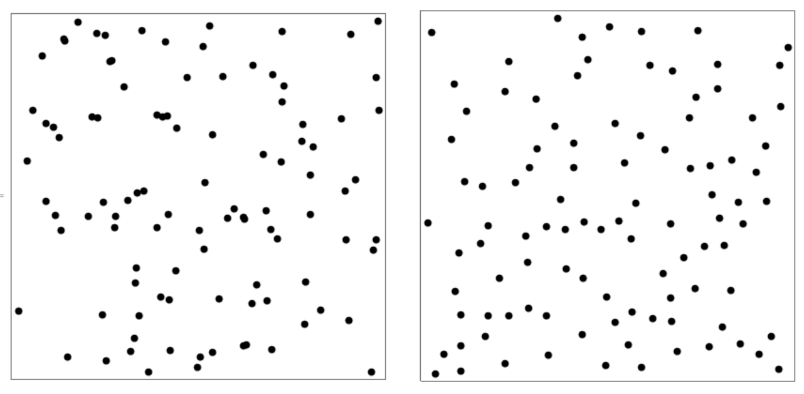
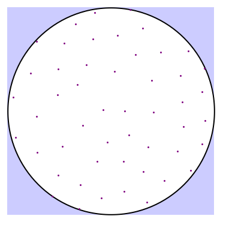
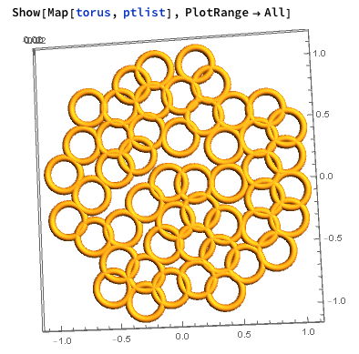
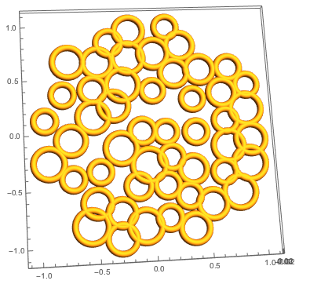
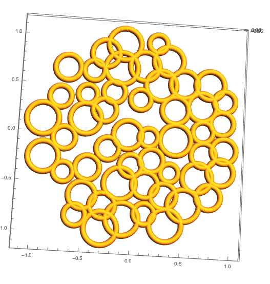
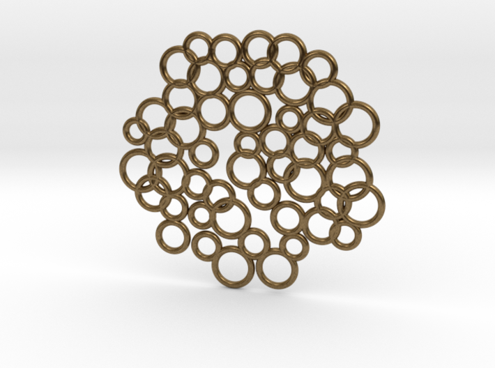
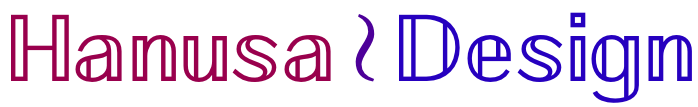

Happy July everyone.  This month I'll share a bit of Mathematica code that has helped me to add some *ordered randomness* to my art and jewelry.  And we'll design a new piece of generative jewelry!

Before that, let me share something else I've been working on.  This June I gave myself a goal to share with the public each day one piece of jewelry I designed.  Designing, refining, and posting took some effort, and I have completed my goal!  In the process I designed some new jewelry that I really like, and I will be working over the coming months to develop them into coherent jewelry collections.  I have been sharing on various social media accounts: @hanusadesign on [instagram](http://instagram.com/hanusadesign/), [facebook](https://www.facebook.com/hanusadesign/), [twitter](https://x.com/hanusadesign), and [pinterest](https://www.pinterest.com/hanusadesign/).  Be sure to follow me to see my latest work!

Now on to the Mathematica tutorial.  What do I mean by ordered randomness?  Compare the following sets of 100 random points:



While the points seem rather "random" in both sets, you can see that the points on the left often land rather close to each other while the points on the right are pretty regularly spaced.  This last observation should tell you that the points on the right are not actually "random"!

Indeed, the points on the left are chosen randomly using Mathematica's `[RandomReal](https://reference.wolfram.com/language/ref/RandomReal.html)` command.  (Even though the numbers are generated by a deterministic process in a computer program and thus inherently not completely random, we will say that pseudorandom is close enough for our purposes.)  The command

```{.mathematica}
ptlist = RandomReal[{-1, 1}, {100, 2}];
```

generates 100 pairs of real numbers that all fall between $-1$ and $1$.  On the other hand, the points on the right are chosen by a selection process in which we grow a list of points, starting with any point in the square.  Then when we want to add a new point to the list, we generate a random point in the square and see if it is greater than a specified distance to any of the points already in our list.  If so, it is added to our list; otherwise it is thrown out!  Here is the code:

```{.mathematica}
ptlist = {RandomReal[{-1, 1}, 2]};
While[Length[ptlist] < 100, 
    newpt = RandomReal[{-1, 1}, 2]; 
    If[Min[Map[Norm[newpt - #] &, ptlist]] > .1, 
       ptlist = Append[ptlist, newpt]]]
```

Running the same code multiple times gives different sets of points.

## Generative jewelry

Let's take this idea and turn it into a nice piece of [generative jewelry](https://en.wikipedia.org/wiki/Generative_art), in that we don't actually know what it is going to look like before our program completes!

My goal is to create a piece of jewelry that is a collection of overlapping rings.  We'll first generate a set of points and then construct rings centered at those points.   We will work to complete three tasks to improve the aesthetic appeal of the final product:

- The points should be lie in a circle instead of a square.

- The points should be generously spaced.

- The rings should be different sizes

For Task 1, we will specify a shape and ensure that each point that we consider is a member of that region.  (Here we choose a circle, but you can easily modify it to be ANY region.)  For Task 2, we will modify our selection process from above to add more distance between the points (radius .21 instead of .1) and have fewer points (50 instead of 100).  By using our selection process, the rings won't overlap too awkwardly and it will be pleasing to the eye.   The values I have chosen are purely by trial and error with a view toward making the proportions of the final product look good.

```{.mathematica}
shape = Disk[{0, 0}, 1];
ptlist = {RandomReal[{-1, 1}, 2]};
While[! RegionMember[shape, ptlist[[1]]], 
    ptlist = {RandomReal[{-1, 1}, 2]}]
While[Length[ptlist] < 50, newpt = RandomReal[{-1, 1}, 2];
    If[Min[Map[Norm[newpt - #] &, ptlist]] > .21 
       && RegionMember[shape, newpt],
       ptlist = Append[ptlist, newpt]]]
Graphics[{
     {Lighter[Blue, .8], Rectangle[{-1, -1}, {1, 1}]},
    {EdgeForm[{Black, Thick}], White, shape},
    {Purple, Point[ptlist]}
}]
```

Notice that we have also ensured that the first point is also in the circular region.  The result of this code looks like this:



Now we want to build a ring centered at each point.  A basic torus that has an outer radius of .14 and tube radius of .03 looks like this:

```{.mathematica}
torus[coords_] := Module[{thickness = .14, innerradius = .03},
    ParametricPlot3D[{
            ( thickness + innerradius  Cos[v]) Cos[u],
            ( thickness + innerradius  Cos[v]) Sin[u],
            innerradius  Sin[v]} + Append[coords, 0], 
    {u, 0, 2 Pi}, {v, 0, 2 Pi}, Mesh -> None, PlotPoints -> 50]];
```

Mapping this function to the points in `ptlist` gives the following.



Now we need to attack Task 3, making the rings have different sizes. To do this we modify our `torus` function:

```{.mathematica}
torus[coords_, thickness_] := Module[{innerradius = .03},
    ParametricPlot3D[{
            ( thickness + innerradius  Cos[v]) Cos[u],
            ( thickness + innerradius  Cos[v]) Sin[u],
            innerradius  Sin[v]} + Append[coords, 0], 
    {u, 0, 2 Pi}, {v, 0, 2 Pi}, Mesh -> None, PlotPoints -> 50]];
```

and generate a set of random outer radii.  I first chose the outer radii to be between .1 and .15, but when I displayed the rings, they were disconnected, which is not what we wanted

```{.mathematica}
thicknesses = RandomReal[{.1, .15}, 50]
Show[MapThread[torus, {ptlist, thicknesses}], PlotRange -> All]
```



So I modified the the outer radii to be between .09 and .17.  I definitely re-ran the code multiple times until I was happy with the final product.  Here you go:

```{.mathematica}
thicknesses = RandomReal[{.09, .17}, 50]
Show[MapThread[torus, {ptlist, thicknesses}], PlotRange -> All]
```



::: {.callout-tip title="Pro Tip"}
Re-running the code always gives you a new arrangement.  When you get a random arrangement that you like, you need to **save the data** that created it, so you can recreate it next time!
:::

In essence, when working to create a piece of generative art, you impose randomness until you find something that you like, at which time you need to save this input so that this data will not change again — which seems to be the opposite of random!  It was a revelation when I realized that adding randomness to my art involved saving the random data I generated.

## The Final Result

After exporting our final work to an STL, here is a rendering of our new piece of generative jewelry on Sketchfab:

<iframe allowfullscreen="" allowvr="" frameborder="0" height="300" mozallowfullscreen="true" onmousewheel="" src="https://sketchfab.com/models/affe8a0915e14f55b8723ec3cd339092/embed" webkitallowfullscreen="true" width="420"></iframe>

And Shapeways gives the following beautiful rendering of our pendant in Raw Bronze:



And now you have the tools to make your own!  If you have suggestions for how to modify this in an interesting way or for something else I should tackle, let me know.  Happy July everyone!

:::: {style="font-size: 110%; text-align: center;"}

Christopher Hanusa's portfolio is available online at

[](http://hanusadesign.com)

Purchase a copy of this and other 3D printed artwork

at [Math Art Shop by Hanusa ≀ Design on Shapeways](https://www.shapeways.com/shops/mathartshop).

::::
