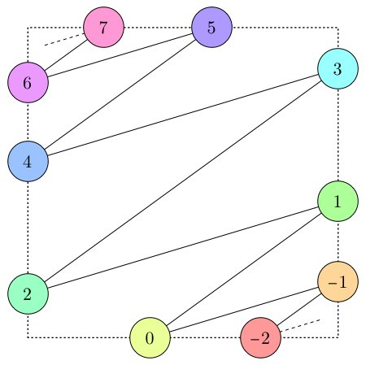
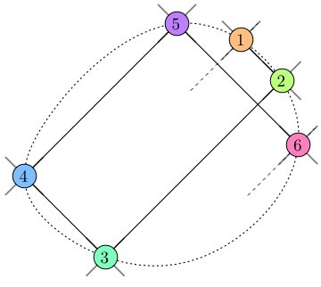

*This post was originally a [Twitter thread](https://x.com/mathzorro/status/1082470898869903366).*

I am excited to share with you an article that I posted to the arXiv today. My collaborator and I worked on an interesting question related to my long-running research in counting placements of chess pieces. 1/3

We ended up creating a new version of billiards with a different rule for bouncing off a wall: instead of obeying the law of reflection, the ball "bounces" by alternating between two fixed directions.

I'm very pleased by its arXiv number: <https://arxiv.org/abs/1901.01917>

Even if you don't read it for its math, do check out our pictures. :)

Oh, and here are two pictures. (4/3)

::: {layout-ncol=2}
{fig-alt="An alternating billiard path in a square table: colored circles numbered from -2 to 7 sit on the dotted edges of the square, joined in order by line segments that zigzag up the table"}

{fig-alt="An alternating billiard path on an elliptical table: six colored circles numbered 1 to 6 on a dotted ellipse, joined by line segments that form a closed path"}
:::
