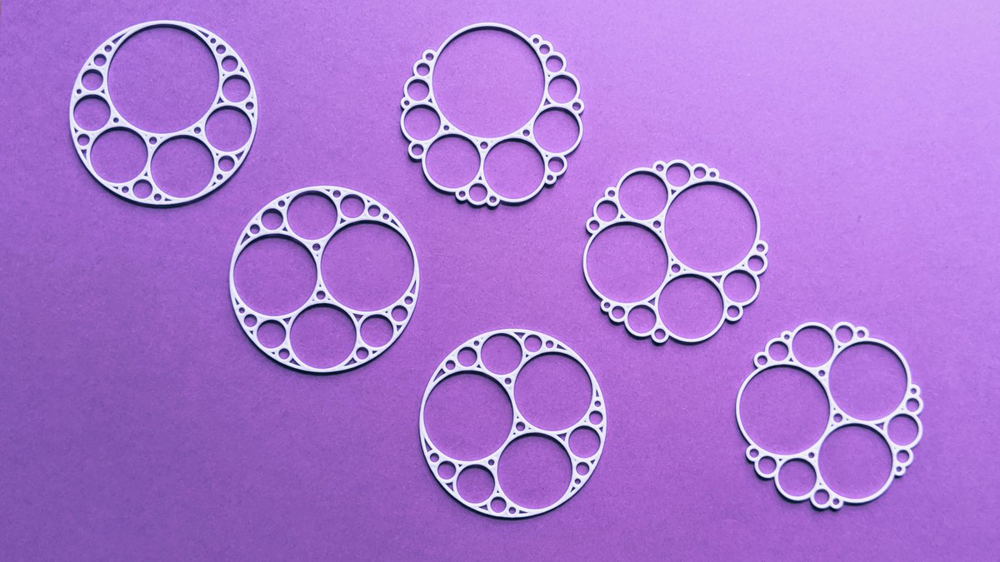
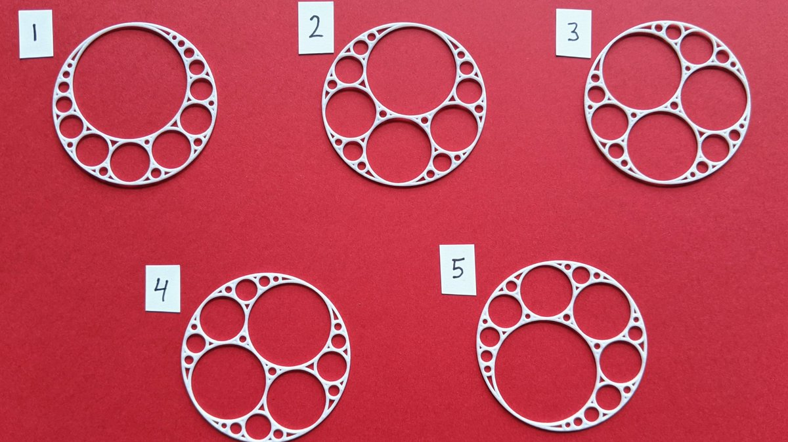

*This post was originally a [Twitter thread](https://x.com/mathzorro/status/1256217632824528897) with three polls; their final results are shown below each poll. See also [More Interesting Math Jewelry](../2020-04-10-more-interesting-math-jewelry/index.qmd) and [An Apollonian Necklace](../2020-05-02-an-apollonian-necklace/index.qmd).*

I had wanted to create Apollonian jewelry for [\@hanusadesign](https://x.com/hanusadesign) but I couldn't figure out how to code them. During [\@anniek_p](https://x.com/anniek_p)'s #mathartchallenge, [\@SWCHS_Maths](https://x.com/SWCHS_Maths) linked to Brent Yorgey's <https://mathlesstraveled.com/2016/04/27/apollonian-gaskets/>, so now they exist. The prototypes came from [\@shapeways](https://x.com/shapeways) and they look great!

{fig-alt="Six 3D-printed white Apollonian circle packing pendants on a purple background. The three on the left have a solid outer circle, and the three on the right have no outer circle, so their small circles form a bumpy edge."}

Now I need your help to choose the design of the official [\@hanusadesign](https://x.com/hanusadesign) earrings!  (Polls below.)

First up: Do you like the design better when it has the outer circle (left models) or without the outer circle (right models)?

| Poll choice | Votes | Share |
|---|--:|--:|
| Keep the outer circle! | 15 | 65% |
| No outer circle! | 8 | 35% |

Next up: Do you like the idea of two copies of the same model (a matched pair) or would you prefer the earrings be two different models (a mismatched pair)?

| Poll choice | Votes | Share |
|---|--:|--:|
| Matched Pair | 14 | 56% |
| Mismatched Pair | 11 | 44% |

Last up: I created five different models by starting with different random starting circles.

{fig-alt="Five white Apollonian circle packing pendants on a red background, labeled 1 through 5, each generated from different random starting circles"}

Which design is your favorite? (Oh no! Twitter only allows four choices! I'll have to consolidate the two most similar ones!)

| Poll choice | Votes | Share |
|---|--:|--:|
| 1 | 4 | 15% |
| 2 or 4 | 10 | 38% |
| 3 | 4 | 15% |
| 5 | 8 | 31% |

Thanks for your votes!  May I suggest that you follow [\@hanusadesign](https://x.com/hanusadesign) here or on Instagram?  And a reminder that to celebrate #mathartchallenge I'm offering 20% off the entire site <http://hanusadesign.com> with code "mathartchallenge".
