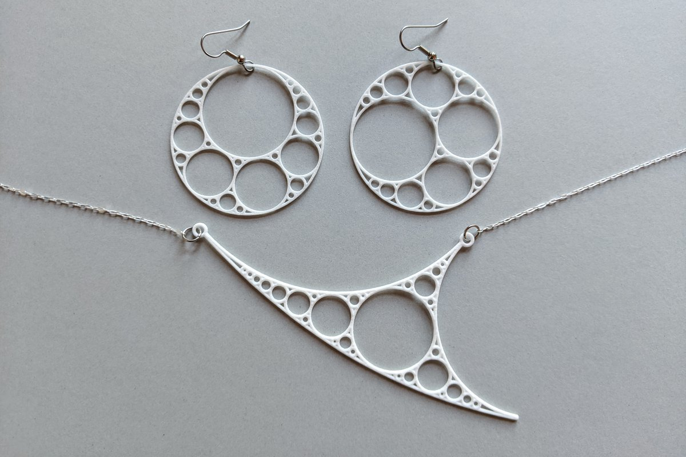

*This post was originally a [Twitter thread](https://x.com/mathzorro/status/1256545927990595584). See also [More Interesting Math Jewelry](../2020-04-10-more-interesting-math-jewelry/index.qmd) and [Designing Apollonian Earrings](../2020-05-01-designing-apollonian-earrings/index.qmd).*

I am loving the positive feedback on yesterday's posts.  Each design seemed to have its champion. Luckily w/3D printing, multiple designs are possible. Models 2&5 seemed to be slight favorites. Extra treat for you today: the Apollonian necklace I designed to go with. #mathjewelry

{fig-alt="A pair of white 3D-printed Apollonian circle packing earrings on hooks, above a necklace whose pendant is a curved triangle filled with circles of decreasing size, on a silver chain"}

Link to the posts and poll results: <https://x.com/mathzorro/status/1256217632824528897>
