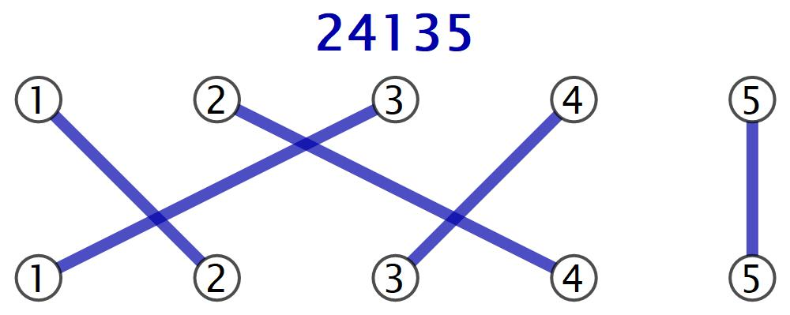
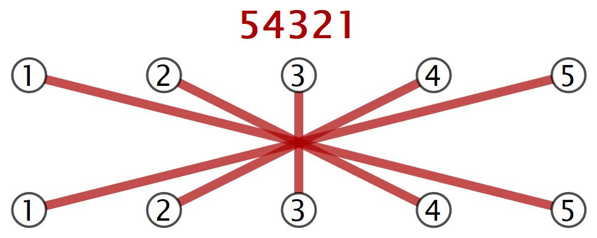
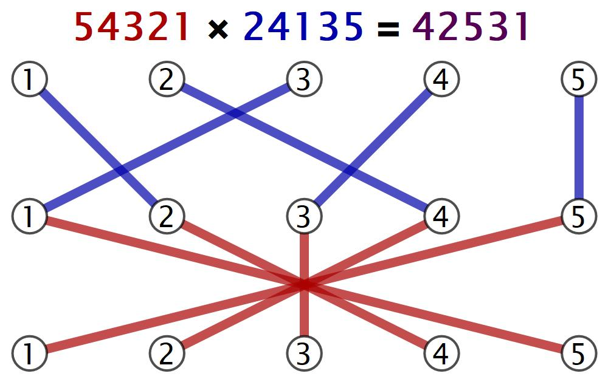

*This post was originally a [Twitter thread](https://x.com/mathzorro/status/1259537489393524737) replying to Annie Perkins's [#MathArtChallenge Day 54: Permutations](https://arbitrarilyclosecom.wordpress.com/2020/05/10/mathartchallenge-day-54-permutations/).*

[L]et's talk about multiplying two permutations. I'll use the example from [Wikipedia](https://en.wikipedia.org/wiki/Permutation_group#Composition_of_permutations%E2%80%93the_group_product), where our two permutations are P=24135 and Q=54321.

We can think about these permutations as functions that move around a set of five objects: P moves the first object to the second position, the second object to the fourth position etc. So another way to represent P would be its two-line notation

```
12345
24135.
```

And Q is

```
12345
54321
```

Multiplying P and Q can be thought of as applying the P function then applying the Q function. So P moves object 1 to position 2 and Q moves it from position 2 to position 4.

All in all, P then Q takes

```
1->2->4,
2->4->2,
3->1->5,
4->3->3,
5->5->1,
```

which means Q\*P=42531. Here we're writing the product in the "reverse" order, just like we write g(f(x)) for the composition that first applies f then g.

(It's important to note that permutations don't commute, so P\*Q is not the same as Q\*P)

OK. Now for the string diagrams. Above we discussed the two-line notation for permutations.  Instead of putting 12345 on the top and the one-line permutation on the bottom, put 12345 on the top and 12345 on the bottom and connect the origin and destination placements with a line.

::: {layout-ncol=2}
{fig-alt="String diagram of the permutation P=24135"}

{fig-alt="String diagram of the permutation Q=54321"}
:::

Because both P and Q have the top and bottom in the order 12345, we can multiply Q\*P by putting P on top of Q and following the strings to see that Q\*P=42531. (The string that starts at 1 ends at 4, 2->2, 3->5, 4->3, 5->1.)

{fig-alt="String diagram of P stacked on top of Q, showing the product Q*P=42531"}

I love how much more visual the whole process is.🙂
