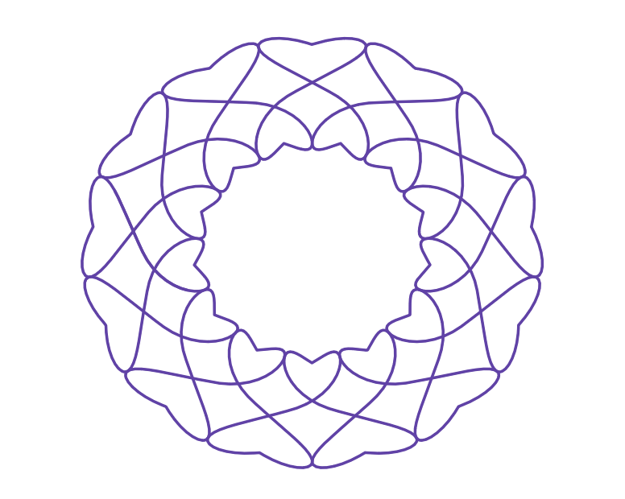

*This post was originally a [Twitter thread](https://x.com/mathzorro/status/1412353674098229249). It started with a [\@DailyDesmos](https://x.com/DailyDesmos)-style challenge from [\@CmonMattTHINK](https://x.com/CmonMattTHINK). I replied with [a slight modification](https://x.com/mathzorro/status/1411796872461754374) and then with [a version after some additional parametric machinations](https://x.com/mathzorro/status/1411887204482355203), both shown below. Then [\@matheser](https://x.com/matheser) asked how I transformed the curve circlewise, and this thread was my answer.*

::: {layout-ncol=2}
{fig-alt="A red Desmos graph of a parametric curve that loops into a row of heart shapes, alternating above and below a center line"}

{fig-alt="A purple Desmos graph of the same row of looping hearts wrapped around into a circular ring"}
:::

[\@matheser](https://x.com/matheser) [\@CmonMattTHINK](https://x.com/CmonMattTHINK) [\@DailyDesmos](https://x.com/DailyDesmos) Sure! Step 1: I started with my original parametric function (x(t),y(t)), applied a vertical translation to get (x(t), y(t)+h) so that the entire graph lies above the x-axis.

Step 2: Apply a polar transformation (r,theta) -> (r cos(theta), r sin(theta)). In effect, think of the x-coordinate above as the angle and the y-coordinate above as the radius. (That is why you want to do the vertical shift.)

This results in the function ((y(t)+h) cos(x(t)), (y(t)+h) sin(x(t))). Hope this helps!

(Realizing now that many people would write k instead of h. I hope this isn't a source of confusion.)
