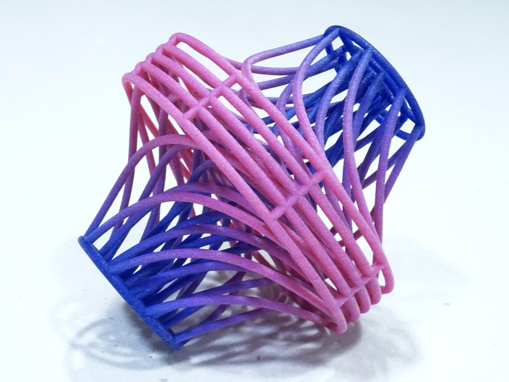
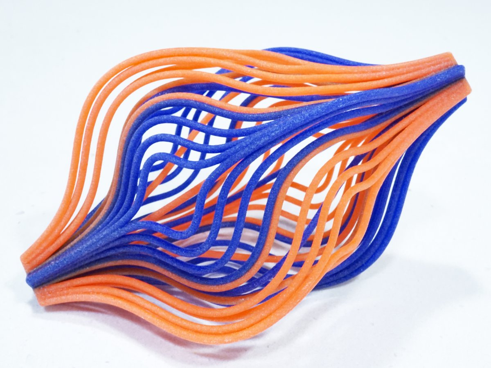

*This post was originally a [Twitter thread](https://x.com/mathzorro/status/1469673726295879682). The Streamlines sculptures were later part of my solo show, [Existence and Uniqueness](../2022-03-05-existence-and-uniqueness-solo-show/index.qmd).*

I am excited to share my #3dprinted mathematical sculptures that will be on display at the #JMM2022 [\@JointMath](https://x.com/JointMath) art exhibition in Seattle. #mathart

::: {layout-ncol=2}
{fig-alt="A 3D-printed sculpture of curved strands that shade from pink to blue, twisting between two square frames along the streamlines of a vector field"}

{fig-alt="A 3D-printed sculpture of orange and blue curved strands that sweep along the streamlines of a vector field, forming a lens shape"}
:::

In these works I explore the streamlines of vector fields. A vector field is an assignment of a direction to every point in space. A streamline is the path that a particle in the vector field would follow if acted upon by those directions.

An example of a vector field is the direction the wind is blowing at all positions in space at a fixed time; a plastic bag that is released at some location would follow a streamline. (if the wind field stays the same)

These models were designed in [\@WolframResearch](https://x.com/WolframResearch) #Mathematica and 3D printed by [\@imaterialise](https://x.com/imaterialise). Thank you to the jury of the art exhibition for this opportunity and for all your work: [\@dansmath](https://x.com/dansmath) [\@RobFathauerArt](https://x.com/RobFathauerArt) [\@BronnaButler](https://x.com/BronnaButler) [\@MariaMannone](https://x.com/MariaMannone)

Thanks for all the interest in my artwork. More #mathart is at <http://christopherhanusa.com>. And if you're looking for mathematically inspired jewelry, check out <http://hanusadesign.com> and follow [\@hanusadesign](https://x.com/hanusadesign).
