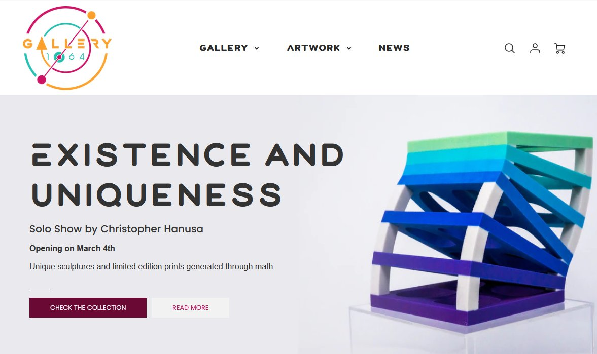
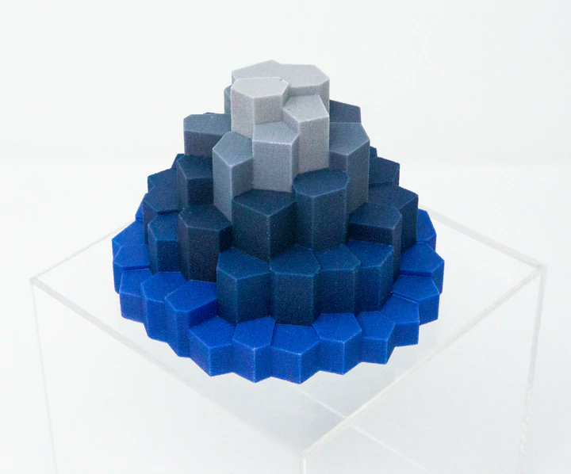
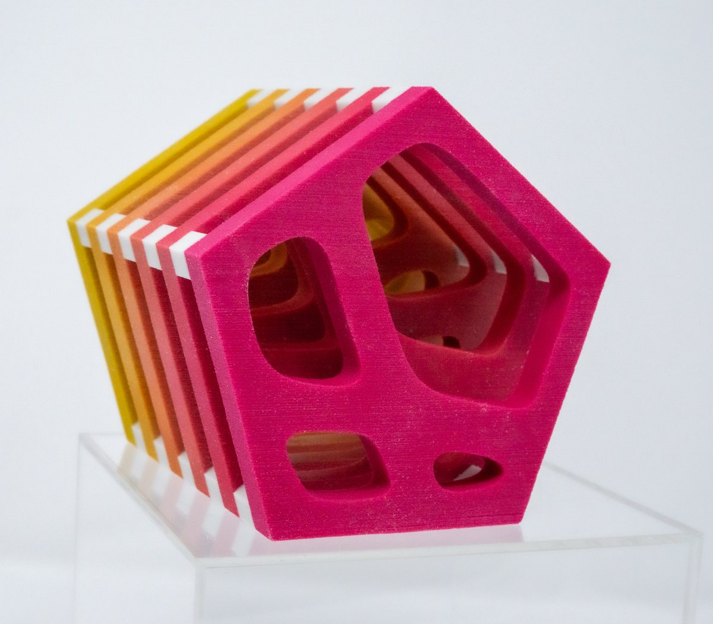

*This post was originally a [Twitter thread](https://x.com/mathzorro/status/1500110527695052801). See also [Streamlines Sculptures at JMM 2022](../2021-12-11-streamlines-sculptures-at-jmm-2022/index.qmd).*

I am very excited to share with you my solo show "Existence and Uniqueness" at Gallery 1064, a new art gallery focused on the fusion of science and art based in Seattle.

Gallery and Interview \>\> <http://gallery1064.com> \<\<

{fig-alt="The Gallery 1064 website announcing Existence and Uniqueness, a solo show by Christopher Hanusa opening March 4th, with a sculpture of stacked blue and green slabs"}

Featured in this show are three of my sculpture collections - Riemannscapes, Window Evolution, and Streamlines.

Riemannscapes are generative sculptures based on a Riemann sum, a technique from calculus to determine the volume of a body.

{fig-alt="A Riemannscape sculpture: a stepped mound of hexagonal columns that shade from bright blue at the base to light gray at the top"}

Window Evolution are also generative sculptures that explore the evolution of an abstract scene in snapshots over time. And the Streamlines sculptures describe the streamlines of vector fields.

{fig-alt="A Window Evolution sculpture: a stack of pentagonal slices shading from yellow to magenta, each with windows cut through it that change shape from slice to slice"}

Each of these sculptures was designed in the computational software [\@WolframResearch](https://x.com/WolframResearch) Mathematica and then 3D printed by [\@Shapeways](https://x.com/Shapeways), a leader in that field.

This exhibit is virtual and available for everyone to see at <http://gallery1064.com>. You can see the artwork, interact with 3D renderings of the pieces to see them from all angles, and read an interview with more details about the exhibit, my process, and philosophy.

A big thank you to Vale, the owner of Gallery 1064 and curator of the exhibit, my colleagues at Queens College, and my family for their support.
