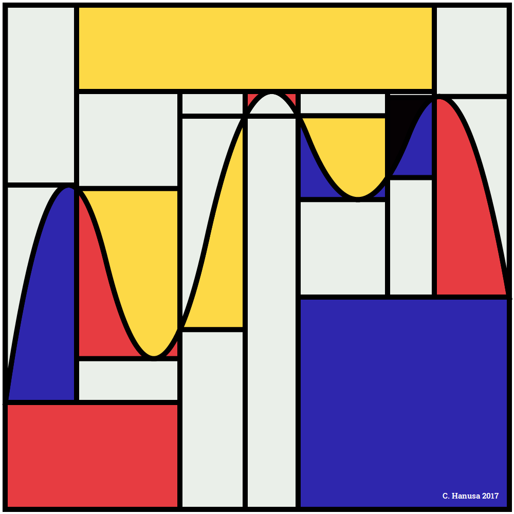
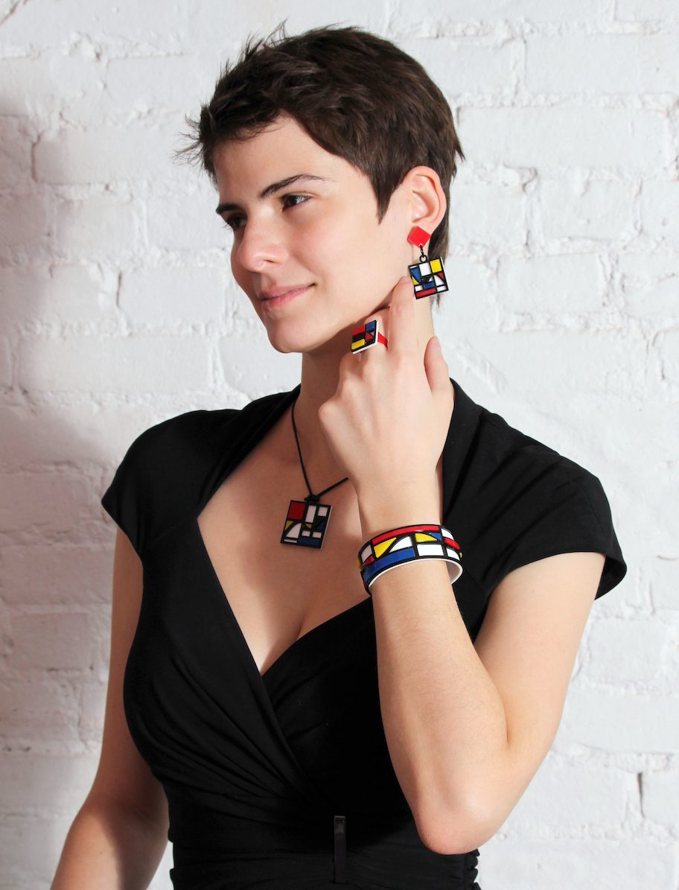
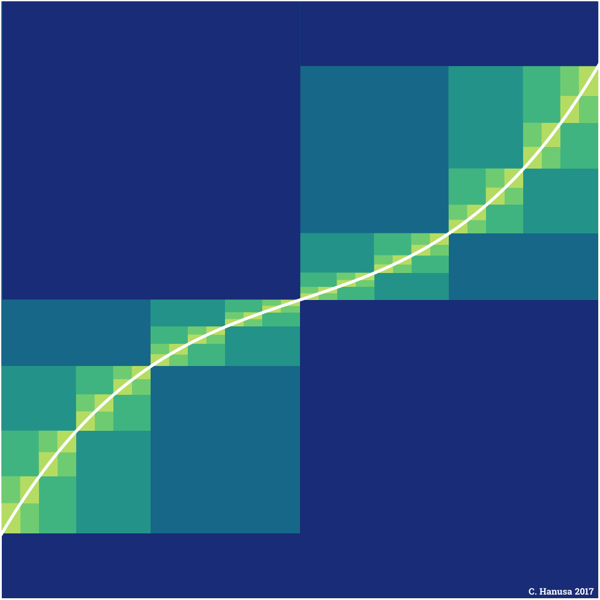

*This post was originally a [Twitter thread](https://x.com/mathzorro/status/1535452653928472582).*

Here's a throwback to my 2017 artwork #Riemondrian, a mashup of #Riemann sums and #Mondrian's #destijl, visible on my portfolio at <http://christopherhanusa.com>. #mathart #generativeart

{fig-alt="Riemondrian: a Mondrian-style grid of red, yellow, blue, and white rectangles with thick black borders. A wavy black curve runs across it, and the rectangles are the Riemann sum rectangles under the curve."}

Recently Riemondrian inspired beautiful work by [\@TheErickLee](https://x.com/TheErickLee) [\@Mathematicspro](https://x.com/Mathematicspro), and their students <https://x.com/Mathematicspro/status/1535271011863625728>. #steam #mathart

Riemondrian also inspired laser cut acrylic jewelry, joint work with Uyen Nguyen ([\@winorigami](https://x.com/winorigami)). This jewelry was featured in the [\@BridgesMathart](https://x.com/BridgesMathart) Math Fashion show in 2019. <https://gallery.bridgesmathart.org/exhibitions/2019-bridges-conference-fashion-show/riemondrian>. Visit <http://hanusadesign.com> or follow [\@hanusadesign](https://x.com/hanusadesign) for more #mathjewelry.

{fig-alt="A model wearing the Riemondrian jewelry set of laser-cut acrylic earrings, ring, pendant necklace, and bracelet, each with a Mondrian pattern of red, yellow, blue, and white blocks with black lines"}

Two limited edition prints of Riemondrian were part of my recent solo show "Existence and Uniqueness" at [\@Gallery1064](https://x.com/Gallery1064). <https://gallery1064.com/collections/christopher-hanusa-solo-show>

If you're looking for more #calculus #mathart, visit <https://christopherhanusa.com/calculus>. Another Riemann sum inspired print is "Riemann Valley" (2017) which shows successive Riemann sums that approach the area under the curve. (Another student project, hint hint?)

{fig-alt="Riemann Valley: an S-shaped white curve on a navy background, with nested rectangles in shades of blue, teal, and green showing successively finer Riemann sums that approach the curve."}

Fun fact: Riemann Valley is actually my most popular print on [\@redbubble](https://x.com/redbubble). Here's the notebook <https://www.redbubble.com/i/notebook/Riemann-Valley-by-hanusadesign/29629892.WX3NH>

Anyone else have any fun calculus art?
