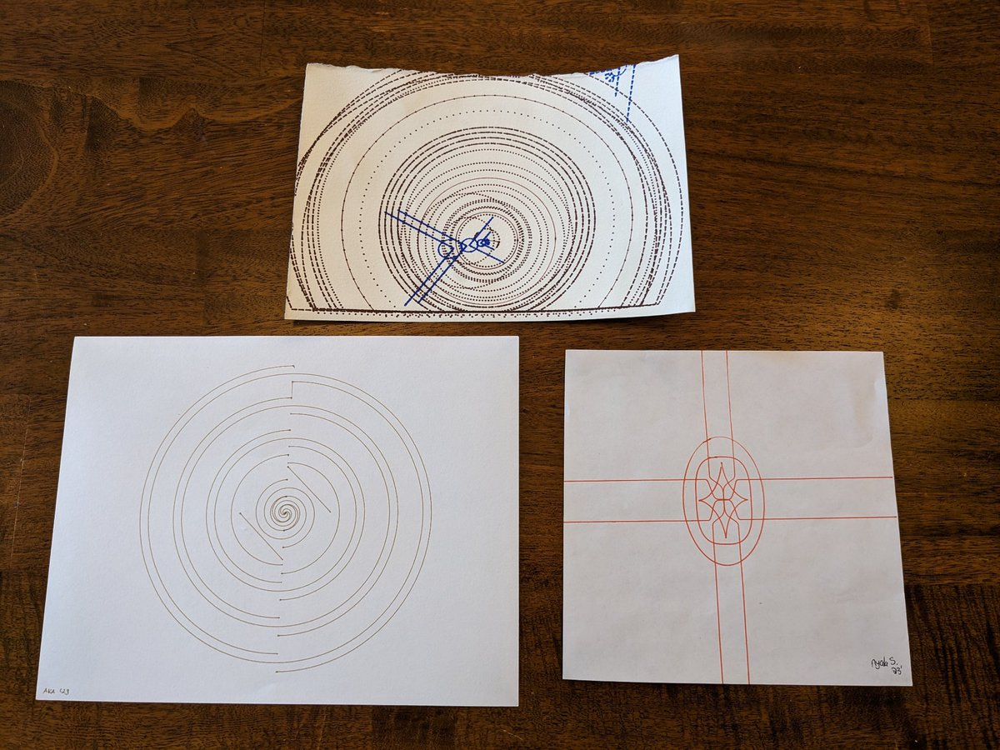
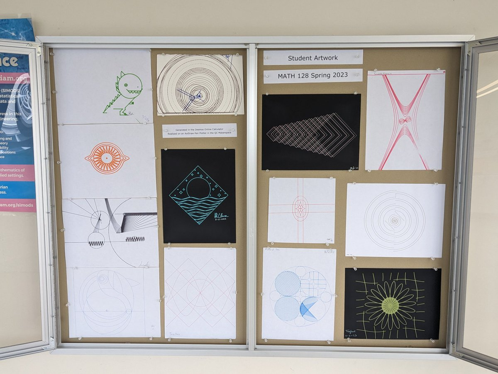
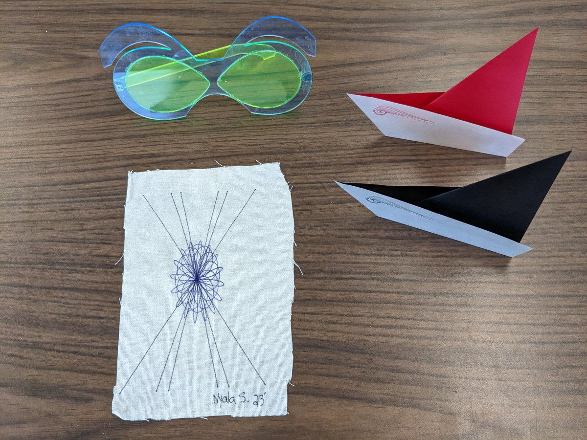
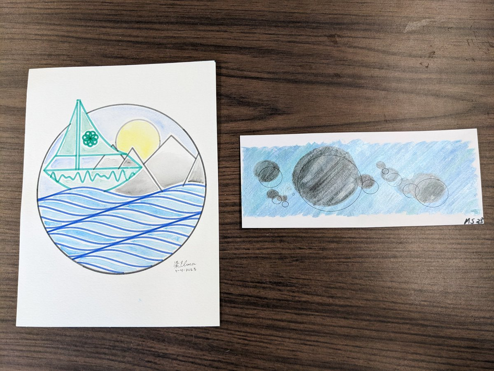

*This post was originally a [Twitter thread](https://x.com/mathzorro/status/1618326275223089152). See also [creating the course](../2020-09-16-creating-a-mathematical-design-course/index.qmd) and [a talk about it](../2023-09-25-a-talk-on-mathematical-design/index.qmd).*

I am so excited to teach Mathematical Design!! It's a class for non-math majors focusing on the creative and artistic aspects of functions. We lean heavily on [\@Desmos](https://x.com/Desmos) for the learning and exploration and on [\@EMSL](https://x.com/EMSL) Axidraw machines in the [\@qcmakerspace](https://x.com/qcmakerspace) to realize student artwork.

Looking forward to sharing what my students create this semester and sharing an OER curriculum for replication at other institutions.

After building point, lists, graphing, and translation skills in [\@Desmos](https://x.com/Desmos), we talked last week about intentionality in art. Today we introduced students to the [\@qcmakerspace](https://x.com/qcmakerspace) and the [\@EMSL](https://x.com/EMSL) AxiDraw machines. Next up - Exploration, design, and development. 🎉🎉🎉

The first project was due last week and here are some of my students' artwork. I am so proud of them!

::: {layout-ncol=3}
{fig-alt="Two pen-plotter drawings on black paper: a diamond framing a moon over waves drawn in light blue, and a series of nested chevrons in pink and white"}

{fig-alt="Three pen-plotter drawings on white paper: concentric dotted circles, a spiral of broken circular arcs, and a red star inside an oval crossed by lines"}

{fig-alt="Three pen-plotter drawings on white paper: a composition of lines, circles, and zigzags, a green dinosaur made of line segments, and a large circle filled with smaller hatched blue circles"}
:::

The stealth [\@Desmos](https://x.com/Desmos) command that was extremely powerful was the function to restrict the output of a graph. Not only can you use it to restrict the domain of a variable {-2\<x\<2}, you can use it to restrict the graph to lie in a particular region {x²+y²\<4}.

Shout out to the [\@qcmakerspace](https://x.com/qcmakerspace), [\@EMSL](https://x.com/EMSL), and [\@inkscape](https://x.com/inkscape) for making it all possible. Next we start work on dilations and then polar plotting.

Finally getting to read my students' lab reports about their process. One student writes "This is the first time I have ever enjoyed and had fun in a math class" 🥰

Another student writes "Collaborating with peers has provided me with different perspectives and ideas, making it possible for me to approach the challenges in a more innovative and effective way and come out with this final piece."

Another student writes "The experience I had with this Axidraw machine was quite a remarkable experience. Yes I had some trials and tribulations along the way, but the end result is amazing. ... The reality that a machine can make math and art come together is wonderful."

I just installed the artwork in a display in the [\@QC_News](https://x.com/QC_News) Math Department. The second project is well on its way.

{fig-alt="A glass display case in a hallway labeled Student Artwork, MATH 128 Spring 2023, holding about fifteen pen-plotter drawings"}

The second module of the class is on dilations, combining functions (+ × ⚬), and polar functions. The focus of the second project is to use more advanced mathematical techniques and being intentional with materials on the AxiDraw.

Here are the second projects. Students were asked to push their mathematical skills, their [\@Desmos](https://x.com/Desmos) programming skills, and their [\@EMSL](https://x.com/EMSL) Axidraw technical skills further. You can see that they took this mandate seriously!

{fig-alt="A table covered with a dozen pieces of student artwork, including string-art curves, spirographs, a watercolor sailboat, a paper star, and a pair of laser-cut glasses"}

For example, these students developed techniques to draw their designs with multiple colors on a dark background.

{fig-alt="Three multicolor pen-plotter drawings on black paper: a smiling face made of flower rosettes, a cartoon figure standing on a spiral, and two orange flowers inside a looping white ring"}

These students explored a different medium for their designs.

{fig-alt="A pair of laser-cut acrylic glasses in blue and green, two folded paper sailboats in red and black, and a plotted rosette design on fabric"}

These students pushed the limits of their mathematical expressions.

{fig-alt="Three dense pen-plotter drawings: a brown hyperbolic X shape made of many curves, overlapping green and navy curve envelopes, and a multicolor star polygon surrounded by a looping pattern"}

And these students decided to work with watercolors! The watercolor was added to the piece on the left after the initial drawing was made, and in the piece on the right, the AxiDraw drew the design directly with a paintbrush!

{fig-alt="Two watercolor pieces: on the left, a plotted sailboat with mountains, sun, and waves inside a circle, colored in after drawing; on the right, gray circles of different sizes painted by the AxiDraw on a blue background"}
