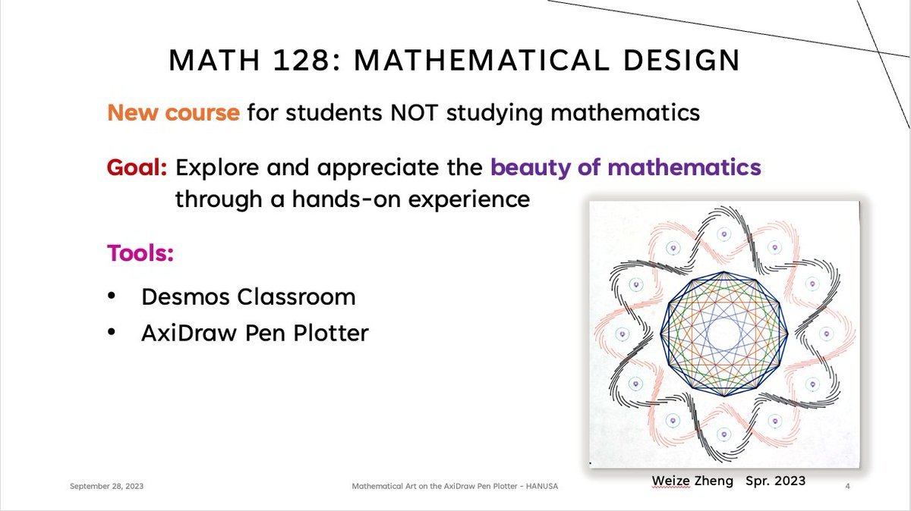
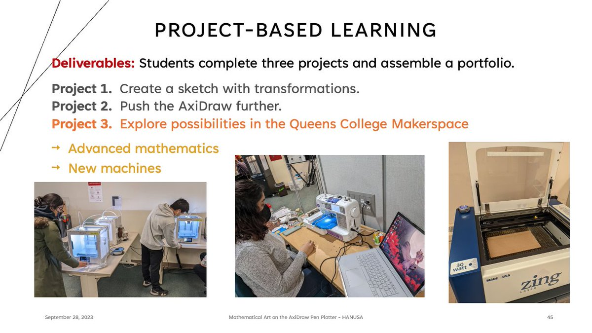
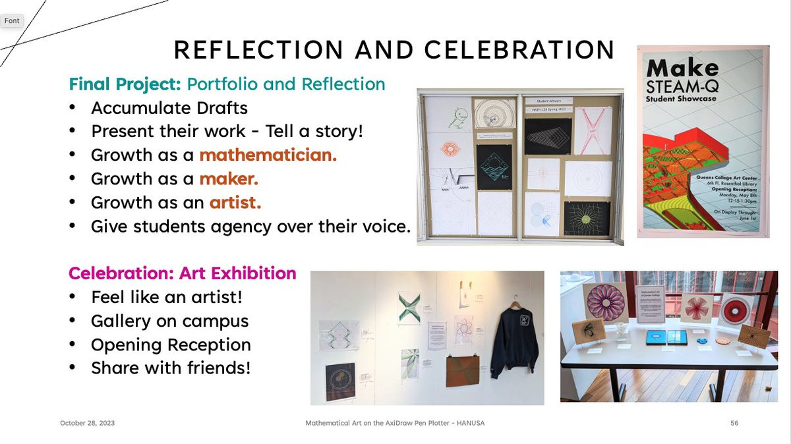

*This post was originally a [Twitter thread](https://x.com/mathzorro/status/1706126524036808928). See also [creating the course](../2020-09-16-creating-a-mathematical-design-course/index.qmd) and [teaching it](../2023-01-25-teaching-mathematical-design/index.qmd).*

I'm giving a talk on Thursday about my [\@Desmos](https://x.com/Desmos) -> [\@EMSL](https://x.com/EMSL) #AxiDraw class in the #MathArt minisymposium in the annual meeting of German Mathematical Society ([\@dmv_mathematik](https://x.com/dmv_mathematik)). Starts at 14:30 Central Euro Time or 8:30am Eastern USA Time. All are welcome; DM for the zoom link.

{fig-alt="Title slide reading Mathematical Art on the AxiDraw Pen Plotter, Christopher Hanusa, Queens College of the City University of New York, next to a line drawing of overlapping polygons"}

Abridged Abstract: I discuss the project-based course "Mathematical Design" I developed to give non-math students a glimpse into the beauty of mathematics. I share information about implementation, best practices for student success, lessons learned, and pictures of student work.

Sneak Preview of slides from tomorrow's talk!

::: {layout-ncol=2}
{fig-alt="Slide titled MATH 128: Mathematical Design, describing a new course for students not studying mathematics, with the tools Desmos Classroom and AxiDraw Pen Plotter"}

{fig-alt="Slide titled Project-Based Learning, listing three projects and showing photos of students using 3D printers, a sewing machine, and a laser cutter in the makerspace"}

{fig-alt="Slide titled Explorer Mindset, about moving students from afraid of math to making mathematical art through support and productive failure"}

{fig-alt="Slide titled Reflection and Celebration, about the final portfolio project and an art exhibition, with photos of the display case and a gallery show"}
:::

Starting in a little over an hour!

Slides from the talk and the links discussed therein are available on my website: <https://hanusa.xyz/talks.html>
