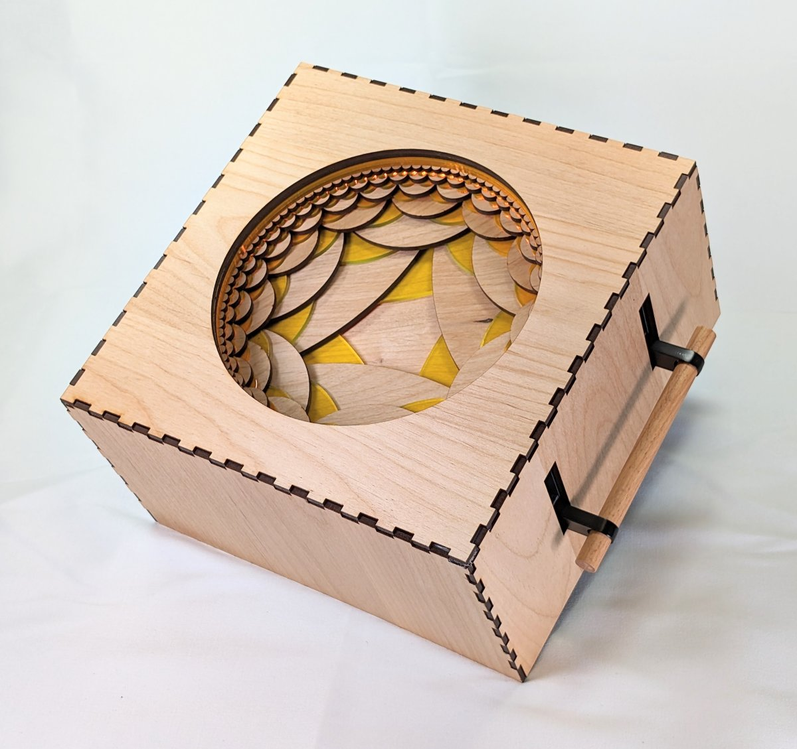

*This post was originally a [Twitter thread](https://x.com/mathzorro/status/1818414200911204781). For the story behind the Apollonian jewelry, see [Designing Apollonian Earrings](../2020-05-01-designing-apollonian-earrings/index.qmd).*

I’m looking forward to the 2024 [\@BridgesMathart](https://x.com/BridgesMathart) Conference. Our new interactive artwork, Hyperbolic Emergence (joint with Eric Vergo) was accepted into this year’s Exhibition of Mathematical Art, Craft, and Design and will be on display all week. #mathart

{fig-alt="Hyperbolic Emergence: a laser-cut wooden box with finger-jointed edges and a wooden handle on one side. A circular window on top reveals layers of wood and yellow acrylic cut into a pattern of arcs that shrink toward the edge, like a hyperbolic tiling."}

On Friday at 2:30pm in STEM 110, I’ll be presenting our paper on the creation of Fractal Emergence, its sister artwork that was at the Joint Math Meetings in January. And it’s right after a talk by the amazing [\@tara_taylor](https://x.com/tara_taylor)!\
<https://x.com/mathzorro/status/1742698553699414080>

Then, on Saturday night, [\@hanusadesign](https://x.com/hanusadesign) Apollonian Jewelry will be on the runway at the Math+Fashion Show. <https://gallery.bridgesmathart.org/exhibitions/2024-bridges-conference-fashion-show/christopher-hanusa>

See the full [\@BridgesMathart](https://x.com/BridgesMathart) exhibition here: <https://gallery.bridgesmathart.org/exhibitions/bridges-2024-exhibition-of-mathematical-art>\
And the full conference program here: <https://www.bridgesmathart.org/b2024/bridges-2024-program-2/>

I’ll end this thread with a reminder to submit your #mathart to the Mathematical Art Digital Exhibition at Queens College. Submission deadline is August 10. <https://x.com/mathzorro/status/1811762523445559595>
